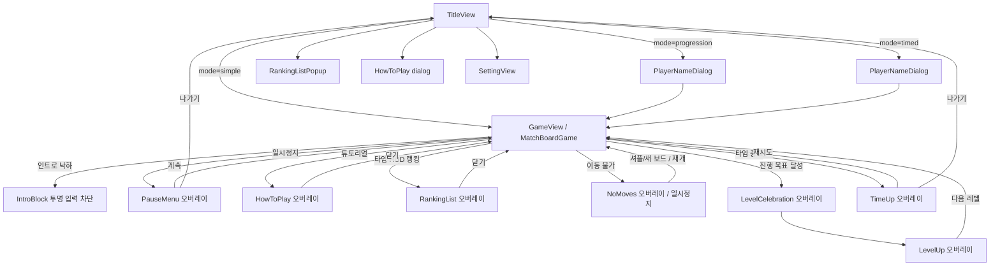

# Product Spec

> Project Brief와 PRD를 통합한다. 제품의 목적, 범위, 요구사항과 비즈니스 규칙의 Source of Truth다.
> 화면 상세는 02_UI_UX.md, 클래스/API는 03_TECH_SPEC.md.

작성 기준일: 2026-08-23, 계약 정합 수정 2026-08-23
근거: 현재 코드와 테스트

## 1. 프로젝트 정의

- 한 줄 정의: 8×8 보드에서 같은 보석을 맞춰 콤보와 특수 보석을 만드는 캐주얼 매치-3 퍼즐
- 대상 사용자: 짧은 시간에 가볍게 플레이하는 퍼즐 유저, 웹/앱인토스/스토어 채널의 캐주얼 게이머
- 해결하려는 문제: 짧은 세션에서도 모드별로 다른 긴장감(연습, 레벨 목표, 타임 어택)을 주고, 기록과 아이템으로 다시 들어오게 한다
- 핵심 가치: 즉시 이해되는 스왑-매치, 특수 보석의 명확한 보상, 강제 광고 없는 보상 교환

표시명: Stone Match (패키지 com.cheng80.stonematch, 내부 디렉터리 jewelmatch)

## 2. Goals / Non-Goals

### Goals

- 무한 / 레벨 / 타임 3모드로 같은 보드 규칙을 제공한다
- 4개 이상 매치와 T/L 교차로 특수 보석을 만들고, 탭으로 발동한다
- 레벨 모드에서 아이템 로드아웃, 클리어 보상, 선택형 보상 광고를 제공한다
- 타임/레벨 기록을 랭킹 서버에 제출하되, 서버 없어도 플레이는 된다
- 웹, Android, iOS, Apps in Toss를 한 코드베이스로 낸다

### Non-Goals

이번 버전에서 하지 않을 것:

- 코인 경제와 인앱 결제 (아이템 플랜 5~6차)
- 영속 PlayerInventory와 타이틀 인벤토리 진입 (3차 미완)
- 특수 보석끼리의 스왑 조합 (Bejeweled Stars식 Flame+Star 등). 하이퍼 큐브 교환(H1, H2)만 2026-09-24 PLAN-005 1a로 활성
- 강제 전면 광고
- 계정 시스템, 소셜 친구, 실시간 멀티플레이
- 외부 GA/Firebase 분석 SDK (2026-09-23 확인: GA4, Firebase Analytics 미연동. 내부 이벤트는 Supabase `game_events`로 보낸다. ADR-009)

## 3. 사용자 유형

| 사용자 | 목적 | 주요 행동 |
|---|---|---|
| 캐주얼 플레이어 | 짧은 연습/클리어 | 무한 모드, 튜토리얼, 설정 |
| 진행 플레이어 | 레벨을 올리고 아이템을 모은다 | 레벨 모드, 로드아웃, 광고 이어하기/보충 |
| 기록 도전자 | 타임 점수 또는 완료 레벨 순위 | 이름 입력, 타임/레벨 종료 시 랭킹 제출 |
| QA/개발 | 특수 효과와 성능 확인 | QA 쿼리, 무한 모드 QA 패널, FPS 패널 |

## 4. 핵심 사용자 흐름

    타이틀 → 모드 선택 → (레벨/타임이면 이름) → 보드 플레이 → 결과/일시정지 → 타이틀 또는 재시도

레벨 모드:

    타이틀 → 이름 → 목표 점수 클리어 → 보상/인벤토리 → 다음 레벨

타임 모드:

    타이틀 → 이름 → 60초 플레이(매치 시 시간 보상) → TimeUp → 랭킹 제출 → 재시도/나가기

## 5. 기능 요구사항

### FR-001 8×8 매치-3 코어

**목적:** 인접 스왑으로 3연속 이상을 제거하고 낙하/리필/콤보가 이어지게 한다.

**동작**
- 가로 또는 세로 같은 색 3연속 이상이 매치다
- 인접 칸만 교환한다. 매치가 없으면 스왑은 되돌아간다
- 제거 칸 위 보석이 떨어지고, 빈 칸은 상단에서 채워진다
- 한 번의 유저 스왑으로 연쇄되면 콤보가 오른다

**조건 / 비즈니스 규칙**
- BR-010: 색 매치 스캔은 일반 보석만 대상이다
- BR-011: 점수는 base = 100 + max(0, removed-3)*50, 이후 (base + specialBonus) * max(1, combo)

**실패 / 예외**
- 무효 스왑은 Fail SFX와 복귀 모션만 발생한다
- 이동이 없으면 NoMoves 오버레이

**Acceptance Criteria**
- [x] 정상 스왑-매치-낙하-리필이 동작한다
- [x] 무효 스왑이 되돌아간다
- [x] 콤보와 한 판 통계가 누적된다

상세: FR-001, 02_UI_UX SCREEN-003

### FR-002 특수 보석

**목적:** 큰 매치의 보상으로 보드를 크게 지우는 특수 보석을 제공한다.

**동작**
- 4일렬 → bomb (3×3)
- T/L/+ → star (행+열)
- 5일렬 → hyper (선택한 일반 색 전부)
- 6+일렬 → supernova (3×3 + 행+열)
- 특수 보석은 탭으로 발동한다. hyper는 손을 뗄 때 발동하고, 인접 보석과 교환하면 H1, 하이퍼끼리 교환하면 H2가 발동한다. non-hyper 특수 보석끼리 교환은 발동하지 않는다
- 효과 범위의 특수 보석은 연쇄 발동한다. bomb, star, supernova 범위의 hyper는 원인 특수 보석 색으로 발동한다(H3). row, col 범위의 hyper는 제거만 된다

**조건 / 비즈니스 규칙**
- BR-020: 생성 우선순위는 교차(star) > 6+(supernova) > 5(hyper) > 4(bomb)
- BR-021: 특수 보석은 색 매치 토큰이 아니다
- BR-022: 특수 보석 스왑 조합은 hyper 교환(H1, H2)만 활성. non-hyper 조합은 비활성
- BR-023: H2 한 번과 이어지는 연쇄의 점수 합은 10000점, 시간 보상 합은 3초를 넘지 않는다(`MatchBoardLogic.hyperPairScoreCap`, `hyperPairTimeCapSeconds`). H2 연쇄가 끝나기 전 안정 구역에서 둔 수도 같은 상한에 포함된다(상한은 보드가 멈출 때 풀린다). 하이퍼는 반환하지 않는다

**실패 / 예외**
- 보드 밖 좌표는 무시한다
- hyper 직접 탭 시 보드에 가장 많은 일반 보석 색을 고른다. 동률이면 작은 색 번호

**Acceptance Criteria**
- [x] 생성/탭 발동/연쇄 규칙이 테스트로 고정된다
- [x] non-hyper 스왑 조합은 발동하지 않고, hyper 교환 H1, H2, H3가 테스트로 고정된다

상세: ADR-001

### FR-003 무한 모드

**목적:** 시간 제한 없이 연습하고 최고 점수를 본다.

**동작**
- 쿼리 mode=simple, 기본 모드
- 힌트 무제한, 아이템 슬롯 없음 (릴리즈)
- 무한 모드 플레이 중 하단 배너 광고 가능

**조건 / 비즈니스 규칙**
- BR-030: 릴리즈 무한 모드 하단은 아이템 슬롯이 아니라 배너 안전 영역이다
- BR-031: debug/profile 무한 모드는 개발용 8슬롯, QA_SPECIAL_EFFECTS=true면 6칸 QA 패널

**실패 / 예외**
- 배너는 일시정지/결과/팝업에서 숨긴다

**Acceptance Criteria**
- [x] 시간 제한 없이 플레이된다
- [x] 릴리즈에서 개발용 아이템 보드가 보이지 않는다

### FR-004 레벨 모드

**목적:** 60초 안에 레벨 목표 점수를 채워 다음 레벨로 간다.

**동작**
- 목표 점수는 BR-040. 1~5는 level * 7500, 6부터는 37500 + (level-5)*5000 (레벨 6 = 42500)
- 클리어 시 LevelCelebration → LevelUp, 점수/콤보 초기화 후 새 보드
- 실패 시 TimeUp. 광고로 같은 스테이지 1회 이어가기 가능
- 하단 4칸 로드아웃, 초기 2칸 오픈. HUD 랭킹 버튼은 없음
- 4의 배수 레벨은 도전 스테이지(BR-043). HUD 점수 아래 줄에 목표 점수 대신 도전 목표와 진행도를 보여 주고, 진입 때 "도전 스테이지" 안내를 2.4초 띄운다

**조건 / 비즈니스 규칙**
- BR-040: JewelRankProgression.scoreTargetForLevel. 레벨 1~5는 level * 7500. 레벨 6부터는 레벨 5 목표 37500에 (level-5)*5000을 더한다. 레벨 6 = 42500, 레벨 10 = 62500. ADR-006
- BR-001: 랭킹 제출값은 완료한 레벨 수. 레벨 4 진입은 3, 레벨 1 미완료는 제출 안 함
- BR-041: 힌트 최초 2개, 다음 스테이지마다 +1, 미사용분 누적
- BR-043: 도전 스테이지(Product Spec 게임 방향 기획 6-8, D9). 4의 배수 레벨은 60초 제한을 그대로 두고 목표 점수 대신 목표 달성으로 클리어한다. k = level ÷ 4(내림)이고 k % 3이 1이면 지정 색 일반 보석 min(15 + 5k, 60)개 제거(색은 ((k - 1) ÷ 3 내림) % 색 수 + 1이라 색 목표마다 다음 색으로 돈다), 2이면 특수 보석 발동 min(2 + k, 10)회(연쇄 포함), 0이면 보석 min(60 + 15k, 200)개 제거다. 실패, 광고 이어하기(진행도 유지), 결과 흐름은 일반 레벨과 같고 스테이지 보상은 목표 달성을 targetRatio 1.0으로 보므로 목표 점수 초과 비율을 요구하는 보상(힌트+ 등)은 나오지 않는다(의도, 플레이테스트에서 확인). NoMoves의 셔플과 새 보드는 진행도를 유지한다. 상수는 `StageChallenge` 한 곳이며 플레이테스트 전 시작값이다
- BR-042: 슬롯 3은 6스테이지 클리어. 슬롯 4는 12스테이지 클리어와, 최근 3스테이지 보상 수량 합계 중 2 이상인 판이 1회 이상일 때 해금

**실패 / 예외**
- 유효 기록 제출: TimeUp 진입 시 자동 제출, 일시정지 나가기는 제출 완료를 기다린다. TimeUp 나가기는 이미 보낸 제출을 기다리지 않는다
- 광고 이어가기는 실패 결과 화면에서만, 시도당 1회

**Acceptance Criteria**
- [x] 목표 달성 시 다음 레벨로 진행한다
- [x] 완료 레벨만 랭킹에 제출한다
- [x] 로드아웃과 클리어 보상이 동작한다
- [x] 4의 배수 레벨은 도전 목표로 클리어한다

### FR-005 타임 모드

**목적:** 60초 동안 최대 점수를 내고 랭킹에 올린다.

**동작**
- 매치 제거마다 정수 초 시간 보상. 양수 raw면 최소 1초, 상한 90초는 초과분 제외
- Speed Bonus(BR-052)와 Last Hurrah(PLAN-005 1c)를 포함한 점수로 랭킹에 올린다
- 남은 시간 0이면 TimeUp
- 아이템 슬롯 없음, 힌트 3개(판마다 초기화)
- 일일 동일 보드(BR-053): 같은 날에는 누구나 같은 시작 보드와 같은 난수 흐름으로 시작한다. 타이틀 타임 버튼 아래에 "오늘의 보드 M월 D일"을 보여 준다

**조건 / 비즈니스 규칙**
- BR-050: raw > 0이면 round(raw), 0초가 되면 최소 1초. raw <= 0이면 보상 없음
  - 예외: H2 흐름은 시간 보상 합 3초 상한(BR-023). 한도가 다 차면 0초
- BR-051: 타임 랭킹은 점수다. score <= 0이면 제출하지 않는다
- BR-052: Speed Bonus는 타임 모드에서 유효 스왑(하이퍼 교환 H1, H2 포함) 확정 직후 판 점수에 더한다. 직전 유효 스왑과 3.5초(`SpeedBonus.windowSeconds`) 안에 이어진 스왑이 3번째가 되는 스왑부터 +200, 이후 100점씩 올라 최대 +1000. 끊기면 0. BR-011과 별도이며 콤보 배수를 적용하지 않는다. 연쇄 단계, 아이템, 특수 보석 탭은 세지 않고, 게임이 멈춘 동안(일시정지, 인트로 채움, 아이템 확인, TimeUp)은 간격 시간이 흐르지 않는다

- BR-053: 타임 모드는 판 시작 시각의 KST(UTC+9) 날짜 키 YYYY-MM-DD로 보드 난수를 만든다(문자열 `stone-match-daily-v1:YYYY-MM-DD`의 FNV-1a 32비트 시드, xorshift32 난수, `lib/game/daily_seed.dart`). Dart `Random(seed)`는 버전마다 수열이 바뀔 수 있어 쓰지 않는다. 시작 보드, 리필, NoMoves 셔플과 새 보드가 이 난수 하나를 쓰고, 힌트 순서, Last Hurrah 하이퍼 색, 시각 효과 난수는 분리한다. Last Hurrah 하이퍼 색 난수도 같은 날짜 시드에서 따로 만든다. 다시 하기도 같은 시작 보드이며 재도전 횟수 제한은 없다(같은 보드 반복 학습 허용). 판 도중 자정이 지나도 시작 시드를 유지한다. NoMoves 새 보드는 판 통계를 유지한다. 무한 모드와 레벨 모드는 무작위다

**실패 / 예외**
- 랭킹 실패는 메시지와 재제출만 제공하고 나가기를 막지 않는다

**Acceptance Criteria**
- [x] 시간 보상과 상한이 동작한다
- [x] 종료 시 점수 랭킹을 제출한다
- [x] 같은 날 같은 입력이면 같은 보드와 점수가 나온다

### FR-006 힌트

**목적:** 막힌 보드에서 유효 스왑을 보여 준다.

**동작**
- 무한: 무제한, 뱃지 없음
- 타임: 3개
- 레벨: 2개 시작, 스테이지마다 +1 누적
- 힌트는 일반 매치 스왑을 우선하고, 없을 때만 hyper 교환을 보여 준다. NoMoves 판정은 hyper 교환도 유효 이동으로 본다
- 제한 모드에서 0개면 동작하지 않는다. 성공 표시 시에만 1 감소

**조건 / 비즈니스 규칙**
- BR-060: 힌트+ 아이템은 잔량을 소모하지 않고 즉시 힌트를 표시한다. 무한 모드에서는 비활성

**실패 / 예외**
- 유효 이동이 없으면 힌트가 소비되지 않는다

**Acceptance Criteria**
- [x] 모드별 잔량과 뱃지가 맞다
- [x] 0개에서 추가 힌트가 나오지 않는다

### FR-007 아이템과 런 인벤토리

**목적:** 레벨 모드에서 한 판을 뒤집는 소비 아이템을 제공한다.

**동작**
- 8종: 룬 망치, 고대 폭탄, 토르 망치, 하이퍼 큐브, 프리즘 변환, 운명의 셔플, 타임 슬립, 힌트+
- 최대 4슬롯, 초기 2오픈, 중복 장착 불가
- 스테이지 시작 후 장착 변경 불가. 클리어 창의 StageInventory에서 다음 판 로드아웃을 바꾼다
- 대상 칸 선택 중 일반 스왑은 막는다. 시계는 BR-073
- 2차 범위: 보유량은 앱 실행 세션(RunInventory)만 유지. 재시작 후 영속 없음

**조건 / 비즈니스 규칙**
- BR-070: 타임 슬립은 시간이 있는 모드만, 힌트+는 제한 모드만
- BR-071: 수량 0이면 슬롯에 있어도 사용 불가
- BR-072: 하이퍼 큐브는 GemKind.normal만 대상. 특수 보석을 고르면 사용 실패, 색상만 참조하지 않는다
- BR-073: 시계는 인트로 낙하, 즉시형 아이템 확인, 프리즘 색 고르는 동안 멈춘다. 일반 칸 선택과 프리즘 색 확정 뒤 보석 지정 중에는 흐른다

**실패 / 예외**
- 대상 선택 취소 시 수량을 깎지 않는다

**Acceptance Criteria**
- [x] 8종 효과가 보드에 반영된다
- [x] 진행 모드 HUD에만 4칸 로드아웃이 보인다
- [ ] 앱 재시작 후 보유량 유지 (3차, 미구현)

상세: FR-007, BR-070~073, SCREEN-003, SCREEN-009

### FR-008 스테이지 클리어 보상

**목적:** 클리어 성과에 따라 아이템을 지급한다.

**동작**
- 클리어 직전 1회 평가. 실패는 지급하지 않는다
- 점수 단독이 아니라 제거/콤보/특수 생성·발동/효율/힌트 보존을 결합한다
- 조건 동시 충족 시 모두 지급, 같은 아이템은 합산
- 조건 미달 클리어는 토르 망치 1개

**조건 / 비즈니스 규칙**
- BR-080: 광고 이어가기 중에는 보상 평가를 미룬다
- BR-081: 같은 결과 화면에서 claim key로 1회만 지급

**실패 / 예외**
- 없음. 최소 보장 보상으로 빈 클리어를 막는다

**Acceptance Criteria**
- [x] 조건별 지급과 합산이 테스트로 고정된다
- [x] 결과 화면에 받은 아이템이 보인다

상세: FR-008, BR-080, BR-081

### FR-009 랭킹

**목적:** 타임 점수와 레벨 완료 수를 공개 순위로 보여 준다.

**동작**
- 타이틀 랭킹 팝업에서 타임/레벨 목록 조회. 상위 30
- 타임 목록과 HUD 1위는 이번 주 기록 기준이다(BR-095). 팝업 탭 이름은 "이번 주 타임"이고 초기화 안내를 보여 주며, HUD 1위 이름 앞에 "이번 주"를 붙인다
- 인게임 HUD 왕관과 top1 fetch, HUD 랭킹 버튼은 타임 모드만
- 타임: 점수, 레벨: 완료 레벨 수
- Apps in Toss는 레벨 기록만 공식 리더보드에도 제출하고, 게임 내 목록은 Supabase 랭킹을 쓴다
- 제출 실패 시 TimeUp에서 재제출 가능
- 저장소는 Supabase다(ADR-009). 제출은 설치 또는 브라우저 단위 익명 사용자로 하고 이름, 점수만 공개한다. 모든 기록을 저장하고 상위 30(원격 설정 `ranking.list_limit`)을 보여 준다
- 2026-09-23 저장소 이전 때 NAS 기록은 가져오지 않고 새로 시작한다(사용자 결정)

**조건 / 비즈니스 규칙**
- BR-001, BR-002
- BR-090: 동일 이름 여러 기록 허용(아케이드)
- BR-091: score <= 0 이면 제출하지 않는다
- BR-092: HUD 랭킹/top1은 타임 전용. 레벨 모드는 타이틀 목록만
- BR-093: Pause 나가기는 제출 await. TimeUp 나가기는 진입 시 fire-and-forget 제출 후 대기 없이 타이틀(타임 모드는 Last Hurrah가 끝난 뒤 TimeUp에 진입한다)
- BR-095: 타임 랭킹은 KST 월요일 00:00에 시작하는 주 단위이고, 주는 제출 시각 기준이다(일요일에 시작해 월요일에 끝난 판은 새 주). HUD 1위는 게임 진입과 다시 하기 때 다시 가져온다. 서버가 `ranking_entries.week_start`(생성 열)로 조회와 순위 계산 범위만 이번 주로 좁히고 기록은 지우지 않는다. 레벨 랭킹은 전체 기간이다. 앱인토스 공식 리더보드는 레벨 완료 수를 유지한다(D8)
- BR-094: 서버는 이름 1~20자, 점수 상한(레벨 10,000, 타임 1,000,000,000), 사용자당 분당 10건만 검증한다. 치트 방지 장치가 아니다

**실패 / 예외**
- 서버 없음/로드 실패/저장 실패는 유형별 메시지만 보여 준다. 플레이와 나가기는 막지 않는다
- Supabase 연결 값 없이 만든 빌드는 연결 불가 메시지를 보인다

**Acceptance Criteria**
- [x] 목록/1위/제출이 동작한다
- [x] 장애가 타이틀 복귀를 막지 않는다
- [x] 재제출이 가능하다

### FR-010 광고

**목적:** 사용자가 선택한 보상 교환과 무한 모드 배너만 사용한다.

**동작**
- continueStage: 레벨 실패 후 같은 스테이지 1회 재개
- refillItem: 수량 0 아이템 1개, 하루 3회
- infiniteBanner: 무한 모드 실제 플레이 하단 96px

**조건 / 비즈니스 규칙**
- BR-100: 강제 전면 광고 없음
- BR-101: rewarded 완료에서만 보상. 로드/클릭/닫힘은 보상 아님
- BR-102: 광고 중 입력/타이머/BGM/SFX 정지, 종료 후 복구
- BR-103: 일일 제한(기본 3회, 원격 설정 `ads.daily_refill_limit`)은 Supabase에서 KST 날짜와 익명 사용자 기준으로 센다. 인벤토리를 열 때 남은 횟수를 서버 값으로 맞추고, 광고 완료 후 서버가 기록을 거절하면 지급하지 않는다. 서버에 닿지 못하면 세션 로컬 제한으로 판단한다. 저장소 삭제나 재설치로 익명 사용자가 바뀌면 제한도 새로 시작한다. 한도를 다 쓰면 보충 버튼은 비활성으로 "오늘 횟수를 모두 사용했습니다"를 보이고, 남은 횟수 자리에 "내일 0시(한국 시간)에 N회로 다시 채워집니다"를 보인다. 광고를 끝까지 봤는데 서버가 한도로 거절하면 같은 한도 문구로 알린다

**실패 / 예외**
- 로드 실패, 미지원, 중도 종료는 보상 없음. 기존 상태 유지

**Acceptance Criteria**
- [x] 세 위치만 존재한다
- [x] 이어가기/보충이 rewarded 완료에서만 지급된다
- [ ] 일일 제한 서버 영속화 (코드 구현, Supabase 원격 적용과 확인 대기. PLAN-006)

상세: ADR-003, FR-010

### FR-011 설정, 언어, 리뷰

**목적:** 볼륨, 화면 켜짐, 언어, 평점을 제공한다.

**동작**
- 설정: 화면 켜짐, FPS 표시, BGM/SFX 볼륨·뮤트, 평점, 언어(ko/en/ja/zh-CN/zh-TW)
- 타이틀 하단 버전 표시
- 모바일: 첫 실행 3일 후 타이틀 리뷰, 첫 클리어 후 리뷰 요청
- 웹: 평점 숨김, 타이틀 자동 리뷰 생략

**조건 / 비즈니스 규칙**
- BR-110: requestReview는 버튼에 직접 연결하지 않는다. 설정 버튼은 스토어 페이지를 연다
- BR-111: App Store ID가 비어 있으면 스토어 이동은 실행되지 않는다

**실패 / 예외**
- 웹/미지원 채널에서는 평점 UI를 숨긴다

**Acceptance Criteria**
- [x] 설정이 로컬에 저장된다
- [x] 웹에서 평점이 숨겨진다
- [ ] 채널별 리뷰 분기와 Apple ID 입력 (출시 전)

### FR-012 온보딩

**목적:** 특수 보석과 기본 조작을 한 번에 보여 준다.

**동작**
- 타이틀과 인게임에서 HowToPlay 오버레이
- 보석 예시와 특수 보석 생성/효과 설명

**Acceptance Criteria**
- [x] 타이틀과 게임에서 열고 닫을 수 있다

## 6. 공통 비즈니스 규칙

- BR-001: 진행 랭킹 = 완료 레벨 수. 미완료 레벨 1은 제출하지 않는다
- BR-002: 랭킹 장애는 플레이/나가기를 막지 않는다
- BR-003: 사용자 문구에 중간점 문자를 쓰지 않는다
- BR-004: 외부 표시명은 Stone Match
- BR-010 ~ BR-111, BR-073, BR-092, BR-093: 위 FR에 정의

## 7. MVP / 이후 범위

### MVP (현재 코드 기준, 플레이 가능)

- 3모드 매치-3, 특수 보석 탭 발동, 힌트 제한
- 레벨 런 인벤토리/보상, 선택형 광고, 랭킹, 다국어, 웹/앱인토스 테스트 빌드

### Later

- 3차 영속 인벤토리와 타이틀 진입
- 광고 일일 제한 서버 영속, 측정 이벤트 연결 (Supabase로 코드 구현, 원격 적용 대기. PLAN-006)
- 코인 경제, 인앱 결제
- 스토어 채널 flavor, Apple ID, 개인정보/지원 URL
- Apps in Toss iPhone 장시간 FPS/오디오 회귀
- 게임 방향 개편: Bejeweled Blitz식 60초 점수 경쟁 중심, 모드 역할 분담, 재화 없는 장기 목표 우선. 상태는 제안(Proposed). 본문은 이 파일 하단 "게임 방향 기획", 결정은 ADR-008, 구현 단계는 PLAN-005
- 내부 이벤트 로거(아이템 플랜 3.5차). 미구현

## 8. 릴리스 기준

- [x] 핵심 User Flow 완료 (로컬/웹 플레이)
- [x] 핵심 Acceptance Criteria 중 구현된 FR의 단위 테스트 존재
- [ ] 치명적 Known Issue 없음: 모바일 웹 장시간 오디오/FPS 회귀는 남아 있음
- [ ] 스토어 메타 URL, Apple ID, 운영 광고 그룹 확정

## 작성 경계

## 상세정보 보존
규칙, 조건, 예외, 계산식, 수치, 성공/실패 조건은 요약하지 않고 이 문서에 둔다. 화면 상세와 구현 HOW는 넣지 않는다. 대형 주제 본문은 이 파일 하단에 흡수되어 있다.


사용자 관점의 WHAT과 WHY를 기록한다. 화면 상세는 02_UI_UX.md, 클래스/DB/API는 03_TECH_SPEC.md.

---

# 게임 플로우

원문 제목 키: `game_flow.md` (이 파일에 흡수됨)

# Stone Match — 게임 플로우 (매치-3)

8×8 보드에서 인접 보석을 스왑해 3개 이상을 맞추면 제거·낙하·리필이 이어진다.

## 1. 규칙 요약

- **매치**: 가로 또는 세로로 같은 색이 3연속 이상이면 매치로 처리된다.
- **스왑**: 인접한 두 칸만 교환 가능하며, 교환 후 매치가 생기지 않으면 스왑은 되돌아간다.
- **낙하·리필**: 제거된 칸 위의 보석이 아래로 떨어지고, 빈 칸은 상단에서 새 보석이 채워진다.
- **콤보**: 한 번의 “유저 스왑”으로 연쇄 매치가 이어지면 콤보로 집계된다.
- **한 판 통계**: 유효 스왑, 매치 그룹, 제거 보석, 특수 보석 생성/발동을 `MatchBoardGameStats`에 누적한다. 게임 오버 화면의 통계 버튼으로 별도 팝업에서 확인한다.
- **심플 모드**: 시간 제한 없음.
- **진행 모드**: 60초 안에 현재 레벨 목표 점수를 넘기면 `LevelCelebration` 후 `LevelUp` 오버레이가 뜬다. 목표 점수는 레벨 1~5가 `level * 7500`, 레벨 6부터는 `37500 + (level-5)*5000`이다. 상세는 **`progression_score_targets.md`**. 다음 레벨로 넘어가면 점수와 콤보를 초기화하고 새 보드를 생성한다. 인게임 HUD 랭킹 버튼은 없다.
- **타임 모드**: 60초 안에 최대 점수를 노린다. 매치 제거 단계마다 **정수 초** 보상(설계값×`timeRewardScaleForMode` 후 반올림)을 받는다. 설계상 보상이 양수(`raw > 0`)이면 반올림이 0이어도 **최소 1초**를 부여한다. 배율 0 등으로 `raw <= 0`이면 보상 없음. 상한(90초)까지 **초과분만 제외**해 가산한다. 남은 시간이 0이 되면 `TimeUp` 오버레이.
- **랭킹**: 타임 모드는 점수, 진행 모드는 완료한 레벨 수를 서버에 제출한다. 진행 모드에서 레벨 4에 진입했다면 제출 값은 3이고, 완료한 레벨이 없는 레벨 1 상태는 제출하지 않는다. HUD 왕관과 top1 조회는 타임 모드만. 일시정지 나가기는 제출 완료를 기다리고, TimeUp 나가기는 진입 시 보낸 제출을 기다리지 않는다. 서버가 없어도 게임 자체는 정상 동작한다. 상세는 **`../tools/ranking_client_contract.md`**.

## 2. 특수 보석 요약

| 조건 | 생성 보석 | 효과 |
|------|----------|------|
| 4개 일렬 | `bomb` | 주변 3×3 제거 |
| T/L 모양 | `star` | 해당 행과 열 제거 |
| 5개 일렬 | `hyper` | 탭 발동 시 기존 normal 색 하나를 골라 해당 색 normal 보석 제거 |
| 6개 이상 일렬 | `supernova` | 주변 3×3 + 해당 행과 열 제거 |

`row`/`col` 특수 보석은 legacy 종류로 남아 있으며, 현재 주 생성 규칙은 위 4종을 사용한다.
특수 보석은 색상 매치 대상이 아니며, 스왑 조합이 아니라 해당 보석을 탭해서 발동한다. 효과 범위 안에 들어간 non-hyper 특수 보석은 연쇄 발동하지만 `hyper`는 제거만 되고 연쇄 발동하지 않는다.
생성 우선순위, 발동 조건, Bejeweled 참고 룰과의 차이는 **`special_gems_rules.md`**를 본다.

## 3. 화면·오버레이 흐름



## 4. 코드 기준 흐름 (요약)

1. 타이틀에서 `/game?mode=...` 로 진입 → `GameView`가 `GameWidget<MatchBoardGame>` 생성.
2. `GameView`는 첫 프레임 뒤 `GameWidget`을 마운트하고 최소 350ms 동안 `GameLoadingOverlay`를 보여준다.
3. `MatchBoardGame.onLoad`에서 `MatchGameHud`(viewport) → `MatchBoardRenderer`(world) → 파티클/특수효과 풀 → QA bridge 순으로 붙는다.
4. 첫 유효 레이아웃(`onGameResize` → `_syncLayout`)에서 타일 크기·보드 위치가 정해지고 `generateFreshBoard`가 한 번 호출된다.
5. 입력은 `MatchGameHud`가 받고, 스왑/상태 전이/점수는 `MatchBoardLogic`, 보석 그리기는 `MatchBoardRenderer`, 특수효과는 `SpecialEffectPool`이 담당한다.
6. `MatchBoardGame.update(dt)`는 보드 업데이트 뒤 특수효과, 보드 전용 지진형 흔들림, 타임/진행 모드 상태, 베스트 저장을 순서대로 갱신한다.
7. `bomb`/`hyper`/`supernova`의 범위형 발동 VFX는 `SpecialEffectBurst`가 `special_area_effects.json` manifest를 읽어 4×4 스프라이트 시트 프레임을 캐싱 렌더한다. `row`/`col`/`star` 라이트닝 계열은 절차형 렌더를 유지한다.

더 자세한 파일 단위 설명은 **`code-flow-analysis.md`**를 본다.


---

# 특수 보석 룰

원문 제목 키: `special_gems_rules.md` (이 파일에 흡수됨)

# Stone Match 특수 보석 룰

이 문서는 현재 코드에 구현된 특수 보석 생성, 발동, 연쇄 처리 규칙을 정리한다.
참고 문서인 `/Users/cheng80/Desktop/Bejeweled_Special_Gems_Guide.md`의 Bejeweled식 개념을 차용하지만, Stone Match의 실제 구현은 일부 조합 규칙이 다르다. Bejeweled식 원본 규칙을 그대로 구현하지 않은 항목은 이 문서에서 “Stone Match식 대체 구현”이라고 명시한다.

## 1. 핵심 원칙

- 보드는 8×8이고 좌표는 0 기반 `(row, col)`이다.
- 일반 매치는 가로 또는 세로로 같은 색 보석이 3개 이상 이어질 때 성립한다.
- 색 매치 스캔은 `GemKind.normal`만 대상으로 삼는다. `bomb`, `star`, `hyper`, `supernova`, legacy `row`, `col`은 더 이상 색상 보석으로 취급하지 않는다.
- 특수 보석은 다른 보석의 3매치 일부가 되지 않는다. 즉 같은 색 일반 보석 2개 사이에 특수 보석이 있어도 3매치가 성립하지 않는다.
- 특수 보석은 “같은 종류끼리 3개 모아야” 발동하는 방식이 아니다. 보드에서 해당 특수 보석을 탭하면 즉시 발동한다.
- 특수 보석 효과 범위 안에 다른 특수 보석이 있으면 연쇄 처리된다. 단, `hyper`는 다른 특수 보석의 범위에 휘말려도 제거만 되고 연쇄 발동 큐에는 들어가지 않는다.

관련 구현:

- 생성 판정: `lib/game/match_board_spawn_classifier.dart`
- 특수 발동 범위와 연쇄 큐: `lib/game/match_board_specials.dart`
- 탭 발동과 스왑 입력: `lib/game/match_board_input.dart`
- 제거, 점수, 상태 전이: `lib/game/match_board_resolution.dart`
- 보석 종류 모델: `lib/game/match_board_models.dart`

## 2. 특수 보석 종류

| 종류 | 현재 표시 이름 | 생성 조건 | 단독 효과 |
|------|----------------|-----------|-----------|
| `bomb` | Bomb 계열 | 같은 색 4개 일렬 | 중심 포함 주변 3×3 제거 |
| `star` | Star 계열 | T/L/+ 교차 매치 | 해당 행 전체 + 해당 열 전체 제거 |
| `hyper` | Hypercube 계열 | 같은 색 5개 일렬 | 기존 normal 보석 색 중 하나를 골라 해당 색 normal 보석 제거 |
| `supernova` | Supernova 계열 | 같은 색 6개 이상 일렬 | 주변 3×3 + 해당 행 전체 + 해당 열 전체 제거 |
| `row` | legacy row | 현재 일반 생성 규칙에서는 만들지 않음 | 해당 행 전체 제거 |
| `col` | legacy col | 현재 일반 생성 규칙에서는 만들지 않음 | 해당 열 전체 제거 |

`row`와 `col`은 이전 저장 상태, QA VFX, 에셋 호환을 위해 남아 있는 종류다. 현재 일반 매치 생성 규칙의 주 대상은 `bomb`, `star`, `hyper`, `supernova`다.

## 3. 생성 우선순위

한 번의 해소 사이클에서 여러 매치 그룹이 잡히면 다음 순서로 특수 보석 생성을 예약한다.

```text
T / L / + 교차 매치
  -> star

6개 이상 일렬
  -> supernova

5개 일렬
  -> hyper

4개 일렬
  -> bomb
```

교차 매치가 먼저 처리되므로, T/L/+ 모양이 총 5칸 이상이어도 `hyper`가 아니라 `star`가 생성된다.

## 4. 생성 위치

특수 보석 생성 위치는 다음 규칙으로 정한다.

1. 유저가 방금 움직인 두 칸 중 매치 그룹에 포함된 칸이 있으면 그 칸을 우선 사용한다.
2. 움직인 칸이 해당 그룹에 없으면 그룹의 가운데 칸을 사용한다.
3. 생성될 특수 보석 칸은 제거 대상에서 제외되어 보드에 남는다.

즉 4개 매치로 `bomb`이 생성되면, 4칸이 모두 제거되는 것이 아니라 생성 위치 1칸은 `bomb`으로 바뀌고 나머지 매치 칸만 제거된다.

## 5. 발동 조건

특수 보석 발동은 기본적으로 “유저가 해당 보석을 탭했는지”로 결정된다.

- `bomb`, `star`, `supernova`, `row`, `col`, `hyper`
  - 보드에서 해당 특수 보석을 탭하면 발동한다.
  - 일반 보석과 단순히 스왑하는 것만으로는 발동하지 않는다.
  - 특수 보석은 색 매치 스캔에 참여하지 않으므로 같은 색 3매치에 포함되어 발동하는 경로가 없다.
- `bomb`, `star`, `supernova`, `row`, `col`
  - 다른 특수 보석 효과 범위에 휘말리면 연쇄 발동 큐에 들어간다.
- `hyper`
  - 직접 탭하면 발동한다.
  - bomb, star, supernova 효과 범위에 휘말리면 원인 특수 보석 색으로 연쇄 발동 큐에 들어간다(H3). row, col 범위면 제거만 된다.

힌트 후보는 일반 매치 스왑을 우선하고, 없을 때만 `hyper` 교환을 보여 준다. non-hyper 특수 보석끼리의 인접 스왑은 힌트 후보가 아니다.

## 6. 발동 효과 범위

| 종류 | 제거 범위 |
|------|-----------|
| `row` | 발동 위치의 행 전체 |
| `col` | 발동 위치의 열 전체 |
| `bomb` | 발동 위치 중심의 3×3. 보드 밖 좌표는 무시 |
| `star` | 발동 위치의 행 전체와 열 전체 |
| `hyper` | `triggerColor`와 같은 색의 모든 normal 보석. `triggerColor`가 없으면 보드에 가장 많은 normal 보석 색(동률이면 작은 색 번호) |
| `supernova` | 발동 위치 중심의 3×3 + 행 전체 + 열 전체 |

효과 범위 안에 다른 특수 보석이 있으면 그 보석도 큐에 들어간다. 이 때문에 `bomb`, `star`, `supernova`, `row`, `col`은 연쇄적으로 발동할 수 있다. `hyper`는 `bomb`, `star`, `supernova` 범위에 들어가면 원인 특수 보석 색으로 발동하고(H3), `row`, `col` 범위면 제거만 된다.

발동 VFX는 룰과 별도 레이어에서 처리한다. `row`, `col`, `star`의 선형/십자 라이트닝은 기존 절차형 렌더를 유지하고, `bomb`, `hyper`, `supernova`의 중앙 범위 폭발/마법 발동은 `assets/images/sprites/special_area_effects.json` manifest가 지정하는 4×4 정방형 스프라이트 시트를 캐싱해 렌더한다. manifest에서 효과별 이미지, 프레임 grid, 표시 scale, blend 모드를 조절한다. 프레임별 투명도와 후반 fade는 PNG alpha에 베이크해 런타임 alpha 필터를 추가하지 않는다.

## 7. 하이퍼 발동 규칙

### 7-1. 보드의 `hyper` 직접 탭

```text
tap hyper
  -> hyper 제거
  -> 보드에 가장 많은 normal 보석 색을 선택(동률이면 작은 색 번호)
  -> 선택된 색의 normal 보석 모두 제거
```

직접 탭한 `hyper`는 상대 보석이 없으므로 `pickExistingColor()`로 보드에 가장 많은 normal 보석 색을 고른다(동률이면 작은 색 번호). 탭은 손을 뗄 때 확정해, 하이퍼에서 시작한 드래그(교환)와 구분한다.

### 7-2. 아이템 `hyperCube`

```text
hyperCube item on normal color N
  -> 선택한 normal 보석 제거
  -> color N인 모든 normal 보석 제거
```

아이템 `hyperCube`는 normal 보석을 대상으로만 사용할 수 있다. 특수 보석은 색상 보석이 아니므로 아이템 대상에서 제외된다.

### 7-3. Hyper 스왑

2026-09-24부터(PLAN-005 1a, ADR-001 개정) `hyper` 교환이 활성이다.

- H1 `hyper + normal`: 교환한 보석 색의 normal 보석과 `hyper`를 모두 제거한다. 매치가 없어도 유효 스왑이며 복귀하지 않는다.
- H1 `hyper + bomb/star/supernova`: 그 특수 보석을 발동하고 그 색 normal 보석을 제거한다. Bejeweled Stars식 변환은 없다.
- H2 `hyper + hyper`: 보드 전체를 제거한다. 하이퍼는 반환하지 않고 점수와 시간 보상은 BR-023 상한 안에서 준다.

## 8. 특수 보석 스왑 조합

`hyper`가 낀 교환(7-3)을 뺀 나머지 특수 보석끼리의 스왑은 조합 효과가 발동하지 않는다.

- `bomb + bomb`
- `bomb + star`
- `star + star`

위 조합들은 과거 또는 Bejeweled 참고 규칙으로는 후보였지만, 현재 Stone Match 플레이 규칙에서는 “특수 보석 직접 탭 발동”으로 대체되어 있다.

특수 보석 간 상호작용은 스왑이 아니라 효과 범위 기반 연쇄로 처리한다. 예를 들어 `bomb` 3×3 범위 안에 `star`가 있으면 `star`가 추가 발동한다. 같은 범위 안에 `hyper`가 있으면 `bomb` 색으로 추가 발동한다(H3).

## 9. 연쇄 해소 순서

유효 스왑이 발생하면 `MatchBoardLogic`은 다음 상태를 반복한다.

```text
resolveMatchCascade()
└─ 해소 사이클 시작
   ├─ findAllMatches()
   ├─ classifyMatchGroups()
   ├─ buildRemovalSet()
   ├─ buildSpecialQueue()
   ├─ applySpawnInfo()
   ├─ activateSpecials()
   ├─ removing
   ├─ falling
   ├─ refilling
   └─ checking
      ├─ 새 매치 있음 -> 다음 해소 사이클
      └─ 새 매치 없음 -> idle
```

각 해소 사이클마다 `combo`가 1 증가한다. 제거, 낙하, 리필 뒤 새 매치가 생기면 같은 유저 스왑에서 이어진 콤보로 본다.

특수 보석 탭 발동은 매치 스캔 없이 다음 흐름으로 시작한다.

```text
triggerSpecialCell(row, col)
├─ 탭한 특수 보석을 removalSet에 추가
├─ 탭한 특수 보석을 초기 queue에 추가
├─ activateSpecials()
└─ removing → falling → refilling → checking
```

## 10. 점수와 시간 보상

제거 단계에서 점수는 다음 방식으로 더한다.

```text
base = 100 + max(0, removed - 3) * 50
score += (base + specialBonus) * max(1, combo)
```

4개 매치로 특수 보석이 생성되면 생성 위치 1칸은 제거되지 않고 `bomb`으로 남으며, 나머지 3칸만 제거된다. 따라서 기본 점수는 `removed = 3` 기준으로 `100`점이 될 수 있다.

특수 보석 발동 보너스:

| 종류 | 보너스 |
|------|--------|
| `row` / `col` | 300 |
| `bomb` | 500 |
| `star` | 800 |
| `hyper` | 1200 |
| `supernova` | 2000 |

Timed/Progression처럼 시간이 있는 모드에서는 제거 단계마다 시간 보상도 계산한다.

```text
raw = (baseUnits + max(0, combo - 1) * perComboTierUnits) * rewardScale
raw > 0이면 round(raw), 단 0초가 되면 최소 1초
raw <= 0이면 보상 없음
```

실제 가산은 모드별 시간 상한을 넘지 않는 범위까지만 적용한다.

## 11. Bejeweled 참고 문서와의 차이

현재 Stone Match는 Bejeweled식 명칭과 일부 기본 아이디어를 참고하지만, 세부 조합은 Stone Match 보드/VFX 구조에 맞춘다.

| 조합/규칙 | Bejeweled 참고 문서 | Stone Match 현재 구현 |
|-----------|---------------------|------------------------|
| Flame + Flame | 대형 폭발 | 스왑 조합 비활성화. 각 `bomb`은 직접 탭하거나 다른 효과 범위에 들어갈 때 기본 3×3으로 발동 |
| Flame + Star | 십자 경로마다 폭발 | 스왑 조합 비활성화. `bomb` 범위에 `star`가 들어가면 `star` 기본 십자 효과가 연쇄 발동 |
| Hyper + Flame | 선택 색을 Flame으로 변환 후 폭발 | hyper와 bomb 교환은 bomb 발동과 그 색 normal 제거. 변환 없음(H1) |
| Hyper + Star | 선택 색을 Star로 변환 후 발동 | 스왑 조합 비활성화. 특수 보석은 색상 대상이 아니며 변환 없음 |
| Star + Star | 다수 행/열 제거 | 스왑 조합 비활성화. 두 `star`가 서로 범위에 들어가면 효과 범위 기반으로 연쇄 가능 |
| Hyper + Hyper | 보드 전체 제거 | 현재 플레이 규칙에서는 비활성화 |

새 조합 효과를 다시 추가하려면 먼저 이 문서를 갱신하고, `match_board_input.dart`, `match_board_special_combos.dart`, `match_board_specials.dart`, 관련 테스트를 함께 수정한다.

### 11-1. 2026-09-23 원문 대조 정정

PopCap 공식 자료(Bejeweled 3 Strategy Guide 2010, Bejeweled 3 Nintendo DS 매뉴얼 2011)와 Fandom 문서를 대조한 결과, 위 표의 "Bejeweled 참고 문서" 열에 적힌 스왑 조합(Flame+Flame, Flame+Star, Hyper+Flame, Hyper+Star, Star+Star)은 Bejeweled 3가 아니라 Bejeweled Stars(2016) 규칙이다. 현재 Stone Match 동작은 바뀌지 않는다. 비교 기준만 정정한다.

| 규칙 | Bejeweled 3 원본 | 근거 | Stone Match 현재 |
|------|------------------|------|------------------|
| Flame, Star, Supernova 발동 | 같은 색 매치에 포함되면 터진다. Flame은 자신과 주변 8칸, Star는 상하좌우 줄 | 공략집 4쪽 "When matched, Flame gems explode", DS 매뉴얼 9쪽 "match them like normal gems" | 탭으로만 발동. 색 매치 토큰이 아님(BR-021) |
| Hypercube 사용 | 옆 보석과 교환하면 그 보석 색을 보드에서 전부 지운다 | 공략집 4쪽 "Use them to match any adjacent gem, regardless of color", DS 매뉴얼 9쪽 "Swap this with any gem" | 교환 불가. 탭하면 보드에 남은 색 중 하나를 코드가 고른다 |
| Hypercube + Hypercube | 교환 가능. 판 전체 제거(효과는 위키 근거). Classic에서는 Hypercube 2개 반환 | 공략집 26쪽 Elite 배지 "Annihilator: matching one Hypercube to another" | 비활성 |
| 폭발에 휘말린 Hypercube | 폭발을 일으킨 보석의 색을 전부 지운다(Blitz 이후) | Fandom Hypercube 문서 | 제거만 되고 발동하지 않음 |
| Supernova 효과 | 공략집은 효과를 공개하지 않음. 위키 기준 3×3 + 행 + 열 | 공략집 4쪽, Fandom Supernova Gem | 3×3 + 행 + 열 |
| 특수 보석끼리의 교환 조합 | 없음 | Fandom Flame Gem, Star Gem, Hypercube의 "In Bejeweled Stars" 절 | 비활성 |

이 정정으로 ADR-001의 "스왑 조합 비활성"은 Bejeweled 3 원형과 오히려 가깝고, "탭 발동"은 원형과 다르다는 점이 확인됐다. 개편 논의는 하단 "게임 방향 기획"을 본다.

## 12. 테스트 기준

현재 특수 보석 규칙은 주로 다음 테스트가 지킨다.

- `test/special_gem_combo_test.dart`
  - 특수 보석끼리 스왑해도 발동하지 않음
  - 탭한 `bomb` 범위 안의 `star`는 연쇄 발동
  - 범위 안의 `hyper`는 제거만 되고 연쇄 발동하지 않음
- `test/match_board_logic_test.dart`
  - 4/5/6개 매치와 T/L 생성 규칙
  - `star`, `supernova`, `hyper` 기본 발동 범위
  - 특수 보석의 탭 발동
  - 특수 보석이 색 매치 토큰이 아님
  - 특수 스왑/힌트 후보 제외 규칙
- `test/special_effect_event_test.dart`
  - 특수 보석별 effect descriptor와 보드 전용 지진형 흔들림 값
- `test/special_effect_pool_test.dart`
  - 특수 효과 풀 재사용과 line sweep 성능 tier


---

# 진행 모드 목표 점수

원문 제목 키: `progression_score_targets.md` (이 파일에 흡수됨)

# Progression Score Targets

진행 모드의 레벨별 목표 점수는 별도 데이터 테이블이 아니라
`lib/game/jewel_rank_progression.dart`의 `JewelRankProgression.scoreTargetForLevel`에서 나온다.
검증: `test/jewel_rank_progression_test.dart`.

각 레벨의 목표 점수는 이전 누적 목표가 아니라, 해당 레벨에서 채워야 하는 단계 목표 점수다.

## Formula

현재 코드의 핵심 상수:

```dart
static const int xpStep = 250000;
static const int scoreToXpScale = 100;
static const int scoreTargetScale = 3;
static const int relaxedStageStartLevel = 6;
static const int relaxedScoreIncrement = 5000;
```

```text
xpNeededForNextLevel(level) = level * xpStep
linearTarget(level) = (xpNeededForNextLevel(level) / scoreToXpScale) * scoreTargetScale
                    = level * 7,500

level 1~5:
  scoreTargetForLevel(level) = linearTarget(level)

level 6+:
  scoreTargetForLevel(level) = linearTarget(5) + (level - 5) * 5,000
                             = 37,500 + (level - 5) * 5,000
```

예시: 레벨 6 = 42,500, 레벨 10 = 62,500. 선형식 `level * 7,500`을 6 이후에도 쓰면 안 된다.

## Targets

| Level | Target score |
|------:|-------------:|
| 1 | 7,500 |
| 2 | 15,000 |
| 3 | 22,500 |
| 4 | 30,000 |
| 5 | 37,500 |
| 6 | 42,500 |
| 7 | 47,500 |
| 8 | 52,500 |
| 9 | 57,500 |
| 10 | 62,500 |
| 11 | 67,500 |
| 12 | 72,500 |
| 13 | 77,500 |
| 14 | 82,500 |
| 15 | 87,500 |
| 16 | 92,500 |
| 17 | 97,500 |
| 18 | 102,500 |
| 19 | 107,500 |
| 20 | 112,500 |
| 21 | 117,500 |
| 22 | 122,500 |
| 23 | 127,500 |
| 24 | 132,500 |
| 25 | 137,500 |
| 26 | 142,500 |
| 27 | 147,500 |
| 28 | 152,500 |
| 29 | 157,500 |
| 30 | 162,500 |
| 31 | 167,500 |
| 32 | 172,500 |
| 33 | 177,500 |
| 34 | 182,500 |
| 35 | 187,500 |
| 36 | 192,500 |
| 37 | 197,500 |
| 38 | 202,500 |
| 39 | 207,500 |
| 40 | 212,500 |
| 41 | 217,500 |
| 42 | 222,500 |
| 43 | 227,500 |
| 44 | 232,500 |
| 45 | 237,500 |
| 46 | 242,500 |
| 47 | 247,500 |
| 48 | 252,500 |
| 49 | 257,500 |
| 50 | 262,500 |
| 51 | 267,500 |
| 52 | 272,500 |
| 53 | 277,500 |
| 54 | 282,500 |
| 55 | 287,500 |
| 56 | 292,500 |
| 57 | 297,500 |
| 58 | 302,500 |
| 59 | 307,500 |
| 60 | 312,500 |


---

# 아이템 슬롯·인벤토리·수익화 플랜

원문 제목 키: `item_slot_market_plan.md` (이 파일에 흡수됨)

# 아이템 슬롯·인벤토리·수익화 플랜

Stone Match의 하단 아이템 슬롯, 인벤토리, 스테이지 종료 보상, 광고/코인/인앱 확장을 위한 기획 문서다. 이 문서는 구현 전 기준을 맞추기 위한 플랜이며, 실제 밸런스와 수익화 범위는 플레이 테스트 지표를 보고 조정한다.

상세 구현 체크리스트는 **`item_slot_market_implementation_checklist.md`**를 기준으로 갱신한다. 스테이지 보상 지급 규칙은 **`stage_reward_system.md`**를 기준으로 한다.

## 최종 목표

- 한 스테이지에 최대 4개 아이템 슬롯을 제공한다.
- 초기 슬롯은 2개만 열고, 나머지 2개는 레벨 또는 슬롯 해금 아이템으로 연다.
- 플레이 전 마켓 겸 인벤토리 화면에서 이번 스테이지에 가져갈 아이템을 선택한다.
- 스테이지 종료 시 플레이 성과를 `MatchBoardGameStats`로 평가해 보너스 아이템을 지급한다.
- 아이템 보유량은 스테이지에 묶지 않고 플레이어 개인 데이터로 저장한다.
- 초기 수익화는 보상형 광고 중심으로 검증한다.
- 코인 경제와 인앱 결제는 지표가 확인된 뒤 선택적으로 붙인다.

## 단계별 로드맵

| 단계 | 범위 | 포함 | 제외 |
|------|------|------|------|
| 0차 | 힌트 제한과 모드별 지급 | 무한 모드 힌트 무제한 유지, 타임 모드 힌트 3개 지급, 레벨 모드 힌트 2개 시작 및 스테이지당 1개 누적 | 아이템 슬롯, 인벤토리, 마켓, 광고, 과금 |
| 1차 | 아이템 효용성 테스트 | 하단 2줄 8개 슬롯, 8개 아이템 즉시 사용, 대상 선택 중 일반 스왑 차단, 아이템별 사용감 확인 | 슬롯 제한, 인벤토리, 보상 지급, 영속 데이터, 광고, 과금 |
| 2차 | 스테이지 종료 보상과 런 인벤토리 | `MatchBoardGameStats` 기반 보상 판정, 결과 화면 보상 표시, 별도 `StageInventory` 창, 4×2 보유 아이템, 레벨클리어 창에서 인벤토리 호출, `RunInventory`, `StageLoadout`, 현재 런 동안 유지되는 보유량, 진행 모드 전용 HUD 슬롯, 슬롯 제한과 슬롯 3/4 해금 이벤트 검증 | 별도 마켓 UI, 영속 데이터, 광고, 과금 |
| 3차 | 영속 인벤토리와 진입 지점 확장 | `PlayerInventory`, 보유량/장착/슬롯 해금 상태 저장, 타이틀/스테이지 준비 화면 인벤토리 진입, 장착 해제, 저장/로드 | 광고, 코인 경제, 과금 |
| 3.5차 | 웹 테스트 이벤트 로깅 | GA/Firebase 전 내부 이벤트 로거, 콘솔/localStorage 기록, QA 로그 패널, 이벤트 이름 표준화 | 외부 분석 SDK, 개인정보 수집 |
| 4차 | 보상형 광고 | 광고 보고 스테이지 이어하기, 광고 보고 아이템 1개 보충, 일일 제한 | 코인 경제, 실제 인앱 결제 |
| 5차 | 코인 경제 선택 | 클리어/업적/일일 보상, 가벼운 아이템 구매 재화 | 구매 압박형 경제, 실제 인앱 결제 |
| 6차 | 인앱 결제 선택 | 광고 제거, 스타터 팩, 아이템 번들, 코인 팩 후보 | 지표 없이 선도입 |

0차는 아이템 슬롯에 들어가기 전에 힌트의 기본 가치를 만들기 위한 선행 작업이다. 무한 모드는 연습모드 성격이므로 힌트 제한을 두지 않고, 타임/레벨 모드부터 제한형 힌트를 적용한다. 1차의 목적은 경제 시스템이나 보상 루프가 아니라 “각 아이템이 실제 플레이에서 쓸 만한가”를 빠르게 확인하는 것이다. 아직 유저가 붙지 않았고 웹게임 테스트가 중심이므로, 슬롯 제한과 인벤토리를 넣기 전에 하단에 8개 아이템 슬롯을 두 줄로 노출해 사용감부터 봤다. 2차부터 슬롯 제한, 런 인벤토리, 스테이지 종료 보상 루프를 붙이고, 현재 HUD 아이템 슬롯은 진행 모드에서만 노출한다.

수익화는 경제보다 아이템 사용 루프를 먼저 검증한 뒤 붙인다. 아이템 부족 시 광고를 볼 만큼 계속 플레이한다는 신호가 나오면 4차 광고를 붙이고, 그 이후에도 리텐션과 사용률이 충분할 때만 코인 경제와 인앱 결제를 검토한다.

현재는 마켓 배포 채널이 정해지지 않았고 웹게임 테스트가 중심이므로 GA/Firebase 같은 외부 분석 SDK를 바로 붙이지 않는다. 먼저 내부 이벤트 이름과 발생 지점을 표준화하고, 웹 QA에서 콘솔 또는 localStorage/sessionStorage로 확인할 수 있게 한다.

## 0차 힌트 제한 정책

힌트는 아이템 슬롯보다 먼저 제한형 리소스로 만든다. 현재 무한 힌트 상태에서는 `힌트+` 아이템의 가치가 없고, 플레이어가 실제로 도움을 필요로 하는 지점도 보기 어렵기 때문이다.

| 모드 | 초기 힌트 | 추가 지급 | 누적 | 의도 |
|------|-----------|-----------|------|------|
| 무한 모드 | 무제한 | 없음 | 제한 없음 | 연습모드 성격 유지 |
| 타임 모드 | 3개 | 없음 | 스테이지 단위로 초기화 | 시간 압박 속 최소 보조 |
| 레벨 모드 | 2개 | 다음 스테이지 진입마다 1개 추가 | 사용하지 않으면 계속 누적 | 장기 진행 보상과 전략적 저장 |

### 0차 힌트 규칙

- 무한 모드는 힌트 갯수 제한을 두지 않는다.
- 무한 모드 UI는 기존처럼 무제한 힌트를 제공하거나, 수량 대신 무한 표시를 사용한다.
- 타임 모드는 스테이지 시작 시 힌트 3개를 지급한다.
- 타임 모드의 남은 힌트는 해당 플레이 안에서만 의미를 두고, 다음 타임 플레이로 누적하지 않는다.
- 레벨 모드는 최초 시작 시 힌트 2개를 지급한다.
- 레벨 모드는 최초 스테이지 이후 다음 스테이지로 넘어갈 때마다 힌트 1개를 추가 지급한다.
- 레벨 모드에서 힌트를 사용하지 않고 다음 스테이지로 넘어가면 남은 힌트는 계속 누적된다.
- 레벨 모드 힌트 수량은 진행 상태와 함께 저장해야 한다.
- 힌트 사용 버튼은 남은 힌트가 0개인 제한 모드에서 비활성화한다.
- `힌트+` 아이템은 이 0차 정책 위에서 힌트 수량을 소모하지 않고 즉시 힌트를 표시하는 아이템으로 다룬다.

## 아이템 목록

| 아이템 | 사용 조건 | 효과 | 구현 기준 | 비고 |
|--------|-----------|------|-----------|------|
| 룬 망치 | 보드 위 보석 1개 선택 | 선택한 보석 1개 제거 | 단일 셀 제거 후 중력·리필·매치 체크 | 가장 먼저 구현할 기본 아이템 |
| 토르 망치 | 보드 위 보석 1개 선택 | 선택 칸 기준 십자 제거 | 기존 `GemKind.star` 발동과 같은 범위, 번개 연출 | 강력한 위기 탈출 아이템 |
| 고대 폭탄 | 보드 위 보석 1개 선택 | 선택 칸 중심 3×3 제거 | 기존 `GemKind.bomb` 범위와 같은 처리 | 룬 망치보다 높은 가격 |
| 프리즘 변환 | 보드 위 보석 1개 선택 후 색 선택 | 선택 보석의 색 변경 | 변경 후 즉시 매치 체크 | 전략형 아이템, UI가 가장 복잡함 |
| 타임 슬립 | 타임이 있는 모드에서만 | 남은 시간 추가 | `timed`/`progression` 모드에서만 슬롯 사용 가능 | 시간 없는 모드에서는 비활성/장착 불가 |
| 운명의 셔플 | 보드 상태가 idle일 때 | 일반 보석만 섞고 특수 보석 보존 | 최소 1개 유효 이동 보장 | 노무브 셔플과 별도 수동 아이템 |
| 힌트+ | 힌트 제한이 있는 모드에서만 | 기존 힌트 횟수 소모 없이 즉시 힌트 표시 | 0차 힌트 제한 정책 위에서 힌트 발동을 아이템화 | 무한 모드에서는 가치가 없으므로 비활성 |
| 하이퍼 큐브 | 보드 위 일반 보석 1개 선택 | 선택한 일반 보석 색상과 같은 일반 보석 전체 제거 | 기존 `GemKind.hyper`와 같은 색상 제거. 특수 보석은 대상이 아니며 선택하면 사용 실패 | 현재 구현 기준 |

## 1차 아이템 효용성 테스트

1차는 정식 경제/인벤토리 기능이 아니라 테스트 UI다. 목적은 아이템 8종의 효과, 선택 흐름, 시간 처리, 보드 밸런스 영향을 빠르게 보는 것이다. 이 단계의 8개 슬롯 HUD는 효용성 검증용 임시 UI였으며, 2차 런 인벤토리 도입 후 무한/타임 모드에서는 제거한다.

- 하단에 8개 아이템 슬롯을 두 줄로 배치한다.
- 모든 아이템을 항상 노출한다.
- 슬롯 제한, 장착/해제, 소지 수량, 런 인벤토리는 구현하지 않는다.
- 각 슬롯은 테스트용으로 바로 사용할 수 있게 한다.
- 아이템 수량 차감은 하지 않거나, 테스트용 무제한으로 둔다.
- 대상 칸 선택이 필요한 아이템은 `itemTargeting` 상태에서 일반 스왑 입력을 막는다. 시계는 아래 아이템 사용 중 시간 처리 규칙을 따른다.
- 테스트 결과를 보고 2차에서 실제 슬롯 제한과 런 인벤토리 구조를 붙인다.

### 1차 하단 슬롯 배치

| 줄 | 슬롯 | 아이템 |
|----|------|--------|
| 1줄 | 1 | 룬 망치 |
| 1줄 | 2 | 고대 폭탄 |
| 1줄 | 3 | 토르 망치 |
| 1줄 | 4 | 하이퍼 큐브 |
| 2줄 | 5 | 프리즘 변환 |
| 2줄 | 6 | 운명의 셔플 |
| 2줄 | 7 | 타임 슬립 |
| 2줄 | 8 | 힌트+ |

1차 UI는 최종 슬롯 정책과 다르다. 최종 구조는 최대 4개 슬롯, 초기 2개 슬롯이다. 1차 테스트에서는 아이템 효용성 확인을 위해 8개를 모두 노출했지만, 현재 플레이 HUD에서는 진행 모드만 `StageLoadout` 슬롯을 표시하고 무한/타임 모드는 하단 아이템 슬롯을 표시하지 않는다.

## 슬롯 규칙

- 슬롯 최대 개수는 4개다.
- 신규 유저의 기본 오픈 슬롯은 2개다.
- HUD 하단 아이템 슬롯은 진행 모드 전용이다.
- 무한 모드와 타임 모드는 아이템 슬롯을 표시하지 않는다.
- 무한 모드와 타임 모드의 기존 아이템 사용 함수는 테스트/QA와 향후 정책 변경을 위해 유지하지만, 일반 플레이 HUD에서는 진입점이 없다.
- 잠긴 슬롯은 게임 HUD 하단에 잠금 상태로 표시한다.
- 슬롯 해금 방식은 두 갈래를 지원한다.
  - 레벨 해금: 진행 모드의 특정 레벨 도달 시 슬롯 3, 슬롯 4 오픈.
  - 아이템 해금: 마켓에서 슬롯 해금권 구매 또는 차후 인앱 상품으로 해금.
- 한 스테이지 시작 후에는 장착 아이템을 바꿀 수 없다.
- 같은 아이템을 여러 슬롯에 중복 장착할지는 초기 버전에서 막는다. 인벤토리 이해가 쉬워지고 밸런스 폭주를 줄인다.

이 슬롯 규칙은 최종 구조 기준이다. 1차에서는 슬롯 제한을 적용하지 않고 8개 테스트 슬롯을 모두 노출한다. 2차에서 런 인벤토리와 `StageLoadout`을 붙이면서 실제 슬롯 제한을 검증한다.

## 슬롯 해금 기준

| 시점 | 슬롯 | 상태 | 해금 처리 |
|------|------|------|-----------|
| 시작 | 슬롯 1, 2 | 오픈 | 룬 망치와 고대 폭탄을 기본 장착한다. |
| 6스테이지 클리어 | 슬롯 3 | 해금 | 레벨업 결과 뒤 `StageInventory` 창을 자동으로 열고 해금 배너와 슬롯 강조 애니메이션을 보여 준다. |
| 12스테이지 클리어 + 최근 3스테이지 보상 수량 합계 중 2 이상인 판이 1회 이상 | 슬롯 4 | 해금 | 같은 방식으로 인벤토리 창을 열고 4번 슬롯 해금을 명시한다. 코드는 `_recentStageRewardTotals.any((total) => total >= 2)`. |

새로 열린 슬롯에는 아이템을 자동 장착하지 않는다. 해금 이벤트는 슬롯이 열렸다는 사실만 보여 주고, 해당 빈 슬롯에 어떤 아이템을 넣을지는 유저가 직접 선택한다. 해금 조건은 현재 런 기준으로 평가하며, 3차 이후에는 `PlayerInventory` 또는 진행 저장 데이터에 해금 상태를 영속화한다.

## 인벤토리 화면

2차에서는 레벨클리어 결과창에서만 호출 가능한 별도 `StageInventory` 창을 구현한다. 결과창 안에 인벤토리 내용을 직접 펼치지 않고, 인벤토리 아이콘을 눌렀을 때 별도 팝업으로 열린다. 이 창은 이후 타이틀 화면, 스테이지 준비 화면, 상단 HUD 등 다른 진입점에서도 재사용할 수 있는 구조로 둔다.

3차에서는 마켓보다 영속 인벤토리 화면을 먼저 확장한다. 구매 기능은 코인 경제를 도입하는 5차까지 미룰 수 있다.

- 상단: 오픈 슬롯 수, 현재 장착 아이템.
- 중앙: 모든 아이템 목록과 소지 수량 배지.
- 하단: 슬롯 해금 조건, 차후 광고/코인/인앱 진입 버튼 자리.
- 스테이지 진입 전: 장착 변경 가능.
- 스테이지 진행 중: 장착 변경 불가, 사용만 가능.
- 인벤토리에는 소지 수량이 0인 아이템도 모두 표현한다.
- 각 아이템 타일은 소지 수량을 뱃지로 표시한다.
- 장착 영역에는 열린 슬롯과 잠긴 슬롯을 모두 표시한다.
- 2차에서는 열린 빈 슬롯을 선택한 뒤 아이템을 눌러 장착한다.
- 2차에서는 해제 전용 조작은 두지 않고, 다른 아이템 장착으로 교체한다.
- 3차에서는 장착된 슬롯을 누르면 해제한다.
- 이미 장착된 아이템은 중복 장착 불가 상태로 표시한다.
- 소지 수량이 0인 아이템은 장착 불가 상태로 표시한다.

이 화면은 3차 구현 범위다. 1차에서는 별도 인벤토리 화면을 만들지 않는다.

### 화면 진입 위치

- 2차: 레벨클리어 결과창의 인벤토리 아이콘으로만 진입.
- 타이틀 화면에서 `인벤토리` 버튼으로 진입.
- 스테이지 시작 전 준비 화면에서 `아이템 선택`으로 진입.
- 게임 오버/클리어 화면에서 `아이템 보충` 진입을 제공할 수 있다.

## 코인 경제

코인은 선택형 5차 기능이다. 1~4차에서는 코인을 지급하거나 저장하지 않는다.

- 스테이지 클리어 시 기본 코인을 지급한다.
- 남은 시간, 점수 초과 달성, 최대 콤보에 따라 보너스를 붙일 수 있다.
- 실패 시에는 기본적으로 코인을 지급하지 않는다. 단, 광고 시청 보상은 별도.
- 아이템 구매와 슬롯 해금에 코인을 소비한다.

코인을 넣더라도 구매 압박용이 아니라 보상 감각용이어야 한다. 클리어 보상, 업적 보상, 일일 보상 정도로 시작하고, 코인 부족을 실패 유도 장치로 쓰지 않는다.

### 5차 후보 밸런스 초안

| 항목 | 코인 |
|------|------|
| 스테이지 클리어 기본 보상 | 20 |
| 목표 초과 보너스 | 0~20 |
| 최대 콤보 보너스 | 0~15 |
| 룬 망치 구매 | 40 |
| 고대 폭탄 구매 | 80 |
| 토르 망치 구매 | 120 |
| 프리즘 변환 구매 | 100 |
| 타임 슬립 구매 | 90 |
| 운명의 셔플 구매 | 70 |
| 힌트+ 구매 | 30 |
| 슬롯 3 해금 | 500 |
| 슬롯 4 해금 | 1200 |

가격은 아이템의 강도보다 “스테이지 실패를 얼마나 직접적으로 막는가”를 기준으로 잡는다. 토르 망치와 프리즘 변환은 고가, 룬 망치와 힌트+는 저가가 맞다.

## 스테이지 종료 아이템 보상

한 스테이지가 끝날 때마다 `MatchBoardGameStats`와 `board.maxCombo`를 기준으로 아이템 지급 조건을 평가한다.

- 1차: 보상 지급 없이 8개 테스트 슬롯으로 아이템 효용성만 확인한다.
- 2차: 마켓이나 영속 데이터 없이, 현재 런 안에서 사용할 수 있는 아이템 수량으로 지급한다.
- 3차 이후: 같은 보상 결과를 플레이어 개인 인벤토리에 누적한다.

### 평가 시점

- 스테이지 클리어 또는 종료 결과 화면으로 진입하기 직전에 1회만 평가한다.
- 광고 재시작을 선택한 경우에는 아직 최종 종료가 아니므로 보상 평가를 미룬다.
- 같은 스테이지 결과에서 중복 지급되지 않도록 보상 처리 완료 플래그를 둔다.
- 실패한 스테이지에도 일부 보상을 줄지는 별도 정책으로 둔다. 2차 버전은 클리어 시에만 지급한다.

### 사용 가능한 통계

| 수치 | 의미 | 보상 판단 예시 |
|------|------|----------------|
| `validSwaps` | 실제 매치가 발생한 유효 스왑 수 | 적은 스왑으로 클리어 시 고급 아이템 지급 |
| `matchGroups` | 생성된 매치 그룹 수 | 많은 매치를 만든 경우 기본 아이템 지급 |
| `removedGems` | 제거한 총 보석 수 | 대량 제거 달성 시 폭발형 아이템 지급 |
| `removedSpecialGems` | 제거된 특수 보석 수 | 특수 보석 활용 보상 |
| `specialGemsCreated` | 생성한 특수 보석 수 | 전략 플레이 보상 |
| `specialGemsActivated` | 발동한 특수 보석 수 | 연쇄/효과 활용 보상 |
| `specialCreatedByKind` | 종류별 특수 보석 생성 수 | 특정 아이템 지급 조건 |
| `specialActivatedByKind` | 종류별 특수 보석 발동 수 | 토르 망치/고대 폭탄 보상 조건 |
| `board.score / targetScore` | 목표 대비 점수 비율 | 점수 단독 보상이 아니라 성과 조건 보조 지표 |
| `board.maxCombo` | 한 스테이지 최대 콤보 | 높은 콤보 달성 보상 |

### 2차 보상 조건 초안

| 조건 | 지급 아이템 | 레어도 | 수량 | 의도 |
|------|-------------|--------|------|------|
| `removedGems >= 100` 또는 `matchGroups >= 18` 또는 `score / targetScore >= 1.12` 그리고 `removedGems >= 75` | 룬 망치 | 기본 | 1 | 꾸준한 제거/매치 성과 보상 |
| `board.maxCombo >= 5` 또는 `removedSpecialGems >= 5` 또는 `score / targetScore >= 1.18` 그리고 `board.maxCombo >= 4` | 고대 폭탄 | 희귀 | 1 | 연쇄와 특수 보석 활용 보상 |
| `specialGemsCreated >= 6` 또는 `score / targetScore >= 1.10` 그리고 `specialCreatedByKind[GemKind.hyper] >= 1` 또는 `score / targetScore >= 1.25` 그리고 `specialGemsCreated >= 3` | 프리즘 변환 | 영웅 | 1 | 특수 보석 제작 중심 플레이 보상 |
| `specialGemsActivated >= 4` 또는 `specialActivatedByKind[GemKind.star] >= 2` 또는 `score / targetScore >= 1.22` 그리고 `specialGemsActivated >= 2` | 토르 망치 | 영웅 | 1 | 특수 효과를 실제로 발동한 보상 |
| `validSwaps`가 1~9 그리고 `removedGems >= 60` | 타임 슬립 | 일반+ | 1 | 적은 스왑으로 클리어한 효율 보상 |
| `matchGroups >= 24` 그리고 (`board.maxCombo >= 4` 또는 `specialGemsCreated >= 3`) | 운명의 셔플 | 일반+ | 1 | 많은 매치와 추가 성과가 함께 나온 보상 |
| 힌트를 줄이지 않고 클리어, `score / targetScore >= 1.15`, `board.maxCombo >= 3` | 힌트+ | 기본 | 1 | 자력 플레이 보상 |
| `removedGems >= 160` 그리고 `board.maxCombo >= 6`, 또는 `score / targetScore >= 1.35` 그리고 `board.maxCombo >= 5` 그리고 `specialGemsCreated >= 7` | 하이퍼 큐브 | 전설 | 1 | 대량 제거·고콤보·특수 제작이 결합된 고급 보상 |
| 위 조건을 하나도 만족하지 못한 클리어 | 토르 망치 | 최소 보장 | 1 | 기준 미달 클리어의 최소 지급 보장 |

한 스테이지에서 지급되는 무료 아이템 개수 제한은 두지 않는다. 여러 조건을 동시에 만족하면 조건별 보상을 모두 지급하고, 같은 아이템이 여러 조건에서 나오면 수량을 합산한다. 결과 화면에는 이번 스테이지에서 받은 아이템과 수량을 먼저 표시하고, 인벤토리는 별도 버튼을 눌렀을 때만 열어 다음 스테이지 장착을 바꾼다.

아이템별 레어도 요약은 **스테이지 보상 체계**의 `아이템 레어도` 표를 기준으로 삼는다.

## 개인 데이터 소유권

3차부터 아이템은 스테이지 귀속 데이터가 아니라 플레이어 개인 데이터다. 1차에서는 이 섹션을 구현하지 않고, 2차에서는 런타임 런 인벤토리만 둔다.

- 보유 아이템 수량은 앱 재시작 후에도 유지한다.
- 장착 슬롯 구성도 개인 데이터로 저장한다.
- 스테이지 시작 시 장착 슬롯의 스냅샷을 가져오되, 실제 보유 수량은 개인 인벤토리에서 차감한다.
- 스테이지 중 사용한 아이템은 즉시 개인 인벤토리에서 차감한다.
- 스테이지 실패, 재시작, 앱 종료 시 차감 롤백 여부를 명확히 정해야 한다. 2차 기본안은 “사용 즉시 차감, 광고 재시작도 복구 없음”으로 둔다.
- 광고/인앱/스테이지 보상으로 획득한 아이템은 모두 같은 인벤토리에 합산한다.

저장 모델은 `PlayerInventory` 같은 독립 모델로 두고, `StageLoadout`은 해당 스테이지에 장착된 아이템 참조만 갖게 한다. 이렇게 하면 진행 모드, 타임 모드, 향후 이벤트 스테이지가 같은 인벤토리를 공유할 수 있다.

## 아이템 사용 중 시간 처리

1차 테스트 HUD에서는 대상 칸을 고르는 동안에도 게임 시간이 계속 흐른다. 아이템 사용 조작이 너무 많은 흐름만 별도로 멈춘다.

- 아이템 버튼을 누르면 `itemTargeting` 상태로 전환한다.
- `itemTargeting` 상태에서도 타임 모드/진행 모드의 남은 시간은 계속 감소한다.
- 대상 칸 선택, 취소, 아이템 사용 실패 처리 후에는 일반 입력 흐름으로 복귀한다.
- 대상 선택 중에는 일반 스왑 입력을 막는다.
- 대상 선택이 필요 없는 아이템은 확인 팝업을 거쳐 발동하고, 확인 팝업이 떠 있는 동안에는 시간이 멈춘다.
- 프리즘 변환은 색상 선택 중 시간이 멈추고, 색상 선택 뒤 보석 대상 선택 중에는 시간이 흐른다.
- 타임 슬립처럼 시간 자체를 변경하는 아이템은 발동 즉시 시간을 더하고 별도 칸 선택을 요구하지 않는다.
- 힌트+는 기존 힌트 잔량을 늘리지 않고, 기존 힌트 잔량을 소모하지도 않으며, 확인 후 즉시 힌트를 표시한다.

이 규칙은 1차 효용성 테스트 기준이다. 대상 선택까지 시간을 멈추면 실제 플레이 압박이 약해지므로, 확인/색상 선택처럼 UI 조작이 추가되는 구간만 정지한다.

## 웹 테스트 이벤트 로깅

2.5차에서는 GA/Firebase를 붙이기 전에 내부 이벤트 로거를 먼저 둔다. 목표는 외부 SDK 선택이 아니라 “무엇을 측정할지”를 고정하는 것이다.

구현 상태(2026-09-23): 로거는 `lib/services/event_logger.dart`(EventLogger)로 구현했고 Supabase `game_events`에 보낸다(ADR-009, TECH_SPEC API-007). 연결한 이벤트는 `session_start`, `round_start`, `round_end`, `level_clear`, `stage_continue`, `ranking_submit`, `ad_reward`와 2026-09-24에 추가한 `item_used`, `item_target_cancel`(item_kind, target_required, mode, level, time_left), `item_earned`(item_kind, quantity, reason, level), `item_equipped`(item_kind, slot_index), `continue_clicked`(mode, level, score)다. 아래 표의 `stage_start`, `stage_clear`, `stage_fail`은 각각 `round_start`, `level_clear`, `round_end`(reason time_up)가 같은 역할을 하므로 따로 만들지 않는다. `item_unequipped`는 슬롯 해제 기능이 없어 해당 없다. 광고 mock 클릭 이벤트는 결과까지 담는 `ad_reward`(placement, result)로 대신한다. GA4와 Firebase Analytics는 연동하지 않았다. 게임 방향 개편에 필요한 추가 이벤트는 하단 "게임 방향 기획" 8절에 둔다.

### 원칙

- 개인 식별 정보는 기록하지 않는다.
- 앱 실행 또는 브라우저 세션 단위의 임시 `sessionId`만 둔다.
- 웹 테스트 빌드에서는 콘솔과 localStorage/sessionStorage에 이벤트를 남긴다.
- QA 빌드에서는 최근 이벤트를 볼 수 있는 간단한 로그 패널을 제공할 수 있다.
- 이벤트 이름과 파라미터는 나중에 GA/Firebase/서버 로그로 그대로 보낼 수 있게 유지한다.
- 외부 분석 SDK는 배포 채널, 개인정보 고지, 동의 정책이 정해진 뒤 붙인다.

### 필수 이벤트

| 이벤트 | 발생 시점 | 주요 파라미터 |
|--------|-----------|---------------|
| `stage_start` | 스테이지 시작 | `mode`, `level`, `loadout_items` |
| `stage_clear` | 스테이지 클리어 | `mode`, `level`, `score`, `max_combo`, `valid_swaps`, `removed_gems` |
| `stage_fail` | 스테이지 실패 | `mode`, `level`, `score`, `reason`, `time_left` |
| `item_earned` | 스테이지 종료 보상 지급 | `item_kind`, `quantity`, `reason` |
| `item_equipped` | 인벤토리에서 슬롯 장착 | `item_kind`, `slot_index` |
| `item_unequipped` | 인벤토리에서 슬롯 해제 | `item_kind`, `slot_index` |
| `item_used` | 아이템 효과 발동 완료 | `item_kind`, `stage_time`, `target_required` |
| `item_target_cancel` | 아이템 대상 선택 취소 | `item_kind`, `stage_time` |
| `continue_clicked` | 실패 화면에서 이어하기 클릭 | `mode`, `level`, `score` |
| `ad_continue_clicked_mock` | 광고 이어하기 mock 클릭 | `mode`, `level` |
| `ad_item_refill_clicked_mock` | 광고 아이템 보충 mock 클릭 | `item_kind`, `source` |

### 보고 싶은 질문

- 어느 모드/레벨에서 실패가 몰리는가.
- 스테이지 종료 보상으로 받은 아이템을 실제로 쓰는가.
- 아이템 대상 선택 중 취소가 많은가.
- 아이템 부족 상태가 자주 발생하는가.
- 실패 화면에서 이어하기 의사가 있는가.
- 광고 보충 버튼이 보이면 누를 의사가 있는가.
- 광고 mock 클릭 이후 다음 스테이지로 이어지는가.

### GA/Firebase 전환 기준

다음 조건이 갖춰지면 외부 분석 SDK 연결을 검토한다.

- 웹 테스트에서 이벤트 이름과 파라미터가 안정화됐다.
- 마켓 또는 배포 채널이 결정됐다.
- 개인정보 처리 고지와 동의 정책이 정리됐다.
- 분석 결과를 보고 실제로 바꿀 제품 결정을 정의했다.

외부 SDK를 붙일 때도 게임 코드 곳곳에서 직접 SDK를 호출하지 않는다. `AnalyticsService` 같은 어댑터를 두고, 내부 이벤트 로거와 GA/Firebase 구현을 교체 가능하게 만든다.

## 광고와 인앱 확장

4차부터 보상형 광고를 붙이고, 인앱 결제는 6차 후보로 둔다. 광고/인앱은 게임 로직과 직접 묶지 말고 인터페이스를 분리한다.

### 보상형 광고

- 광고 위치와 보상, 제한, SDK 공통 동작은 **`../release/ad_placement_policy.md`**를 따른다.
- 초기 광고 위치는 진행 모드의 스테이지 이어하기와 아이템 1개 보충 두 가지다.
- 코인 경제와는 분리하고, 광고 보충을 아이템 구매의 대체재로 시작한다.

### 인앱 결제

- 광고 제거.
- 스타터 팩.
- 아이템 번들.
- 코인 경제를 도입한 경우에만 코인 팩 구매.
- 광고 제거 상품은 차후 검토한다.

정책상 광고와 인앱 결제는 플랫폼별 SDK, 개인정보 동의, 스토어 심사 문구가 필요하다. 따라서 게임 로직과 직접 묶지 말고 `AdRewardService`, `EconomyService`, `PurchaseService` 같은 경계로 나눈다.

### 인앱 결제 도입 판단 지표

인앱 결제는 다음 신호가 있을 때만 검토한다.

- D1/D7 리텐션이 유지되고 있다.
- 실패 후 광고 이어하기 사용률이 의미 있게 높다.
- 아이템 부족 시 광고 보충 사용률이 높다.
- 광고를 보고도 이탈하지 않고 다음 스테이지를 계속 플레이한다.
- 특정 아이템의 반복 수요가 확인된다.

이 신호가 없으면 과금 UI는 넣지 않는다. 초반에 과금 UI가 먼저 보이면 게임이 가벼운 캐주얼 퍼즐보다 결제 유도형으로 보일 수 있다.

## 구현 단계

### 0차: 힌트 제한과 모드별 지급

- 현재 무한 힌트 사용 흐름을 모드별 정책으로 분기한다.
- 무한 모드는 연습모드로 보고 힌트 무제한을 유지한다.
- 타임 모드는 새 플레이 시작 시 힌트 3개를 지급한다.
- 레벨 모드는 최초 힌트 2개로 시작한다.
- 레벨 모드는 최초 스테이지 이후 다음 스테이지로 넘어갈 때마다 힌트 1개를 추가한다.
- 레벨 모드에서 사용하지 않은 힌트는 다음 스테이지로 누적한다.
- 레벨 모드 힌트 잔량은 진행 저장 데이터에 포함한다.
- 제한 모드에서 힌트 사용 시 잔량을 1 감소시키고, 0개면 힌트 버튼을 비활성화한다.

### 1차: 아이템 효용성 테스트

- `ItemKind` 모델 추가.
- 하단에 8개 테스트 슬롯을 두 줄로 배치한다.
- 8개 아이템을 모두 노출하고 바로 사용할 수 있게 한다.
- 하이퍼 대응 아이템 `하이퍼 큐브`를 추가한다.
- 슬롯 제한, 수량 차감, 보상 지급, 런 인벤토리, 영속 저장은 구현하지 않는다.
- 아이템 사용감과 보드 밸런스 영향만 확인한다.

### 1차: 보드 효과 연결

- 룬 망치: 선택 셀 제거 후 기존 중력·리필·매치 체크 흐름에 연결.
- 고대 폭탄: 선택 셀 중심 3×3 제거.
- 토르 망치: 선택 셀 기준 `GemKind.star`와 같은 십자 제거 및 번개 연출.
- 하이퍼 큐브: 선택한 normal 보석 색상과 같은 normal 보석 전체 제거.
- 특수 보석은 색상 보석이 아니므로 하이퍼 큐브 아이템 대상에서 제외한다.
- 하이퍼 큐브와 특수 보석의 비주얼드식 확장 조합은 차후 후보로 둔다. 예를 들어 `Hyper + Star`가 같은 색 일반 보석들을 Star로 바꾸고 연쇄 발동하는 방식은 화려하지만 밸런스와 연출 비용이 크므로 1차 범위에서 제외한다.
- 운명의 셔플: 특수 보석 위치를 보존하고 일반 보석만 섞는다.
- 타임 슬립: `hasTimedClock`이 true인 모드에서만 시간 추가.
- 대상 칸 선택이 필요한 아이템은 선택 완료 또는 취소 전까지 일반 스왑 입력을 막는다. 시계는 아이템 사용 중 시간 처리 규칙을 따른다.

### 2차: 스테이지 종료 보상과 런 인벤토리

- `RunInventory` 모델에 앱 실행 세션 동안의 아이템 보유 수량을 저장한다.
- `StageLoadout` 모델에 이번 스테이지에 장착된 4칸 슬롯 구성을 저장한다.
- 하단 HUD는 4칸 슬롯을 표시하고, 2차 초기 상태에서는 2칸만 사용 가능하며 나머지 2칸은 자물쇠로 표시한다.
- 레벨클리어 창에는 받은 보상을 먼저 표시하고, 인벤토리 버튼을 눌렀을 때만 4×2 인벤토리를 열어 다음 스테이지에 쓸 2칸 장착 항목을 설정한다.
- 게임 중 인벤토리 장착 변경은 2차에서 보류한다.
- 레벨클리어 창의 바깥 팝업만 `assets/images/ui/obsidian_panel_frame.png` 나인패치를 사용하고, 안쪽 인벤토리는 일반 Flutter 슬롯/패널로 그린다.
- 유저에게 보여 주는 화면 문구에는 `임시`라는 용어를 쓰지 않는다.
- 실제 슬롯 제한을 적용한다.
- `MatchBoardGameStats`와 `board.maxCombo`를 입력으로 받는 보상 판정기를 만든다.
- 조건별 지급 아이템과 우선순위를 데이터 테이블로 분리한다.
- 지급 결과를 `RunInventory`에 합산한다.
- 결과 화면에 아이템 보상 내역을 표시한다.
- 현재 런의 이후 스테이지에서 임시 보유 아이템을 사용할 수 있게 한다.
- 2차 아이템은 다음 스테이지 한 번만 유효한 보상이 아니라, 사용하거나 런이 초기화될 때까지 `RunInventory`에 남는다.
- 마켓, 코인 구매, 슬롯 해금, 앱 재시작 후 유지 저장은 구현하지 않는다.

### 3차: 인벤토리 화면과 영속 데이터

- `PlayerInventory` 모델에 보유 수량, 장착 슬롯, 슬롯 해금 상태를 저장한다.
- `StageLoadout` 모델은 스테이지 시작 시 선택한 슬롯 구성을 나타내는 스냅샷으로 둔다.
- `GameSettings` 또는 별도 저장소에 로컬 영속화한다.
- HUD 하단에 최대 4개 슬롯을 표시한다.
- 타이틀 또는 스테이지 준비 흐름에서 접근 가능한 화면을 만든다.
- 모든 아이템을 인벤토리에 표시하고 소지 수량을 뱃지로 보여준다.
- 보유 아이템, 장착, 장착 해제를 한 화면에서 처리한다.
- 빈 슬롯 선택, 아이템 장착, 장착 해제를 지원한다.
- 잠긴 슬롯은 조건과 해금 버튼을 같이 보여준다.

### 3.5차: 웹 테스트 이벤트 로깅

- `AnalyticsService` 인터페이스를 추가한다.
- 웹 테스트용 구현은 콘솔과 localStorage/sessionStorage에 이벤트를 기록한다.
- QA용 최근 이벤트 로그 패널을 선택적으로 제공한다.
- 스테이지 시작/종료, 아이템 획득/장착/사용/취소, 광고 mock 클릭 이벤트를 기록한다.
- GA/Firebase 연동은 하지 않는다.

### 4차: 광고 연결 준비

- 보상형 광고 인터페이스를 만들고 mock 구현으로 시작한다.
- 광고로 아이템 구매 대체, 광고로 스테이지 재시작을 붙인다.
- 아이템 부족 시 광고 시청으로 해당 아이템 1개를 보충한다.
- 광고 보충과 광고 재시작에는 일일 제한을 둔다.

### 5차: 코인 경제 후보

- 스테이지 클리어 결과에서 코인 보상을 계산한다.
- 보상 내역을 클리어 화면에 표시한다.
- 보유 코인을 저장하고 인벤토리/마켓 구매에 반영한다.
- 지표가 부족하면 이 단계는 생략한다.

### 6차: 인앱 결제 후보

- 인앱 상품 ID와 상품 타입을 데이터로 분리한다.
- 광고 제거, 스타터 팩, 아이템 번들을 우선 후보로 둔다.
- 코인 경제를 도입한 경우에만 코인 팩을 검토한다.
- D1/D7 리텐션, 광고 이어하기 사용률, 아이템 부족 빈도, 스테이지 실패율을 보고 도입 여부를 결정한다.

## 코드 설계 메모

- 보드 제거 효과는 `MatchBoardLogic`에 “아이템으로 인한 제거” 진입점을 추가하는 편이 낫다.
- 특수 보석 발동과 아이템 발동은 연출을 공유하되, 통계는 분리한다.
- 아이템 사용은 보드 상태가 `idle`일 때만 허용한다.
- 아이템 선택 중에는 일반 스왑 입력을 잠근다.
- 아이템 대상 칸 선택 중에는 일반 스왑 입력만 막고 타이머는 계속 업데이트한다.
- 분석 이벤트는 직접 GA/Firebase를 호출하지 말고 `AnalyticsService`를 통해 남긴다.
- 타임 슬립은 `MatchBoardGame`의 시간 상태를 건드리므로 보드 로직이 아니라 게임 레벨에서 처리한다.
- 힌트 제한은 0차에서 먼저 구현한다. `힌트+`는 제한 모드의 힌트 잔량을 소모하지 않고 즉시 힌트를 표시하는 아이템으로 붙인다.
- 스테이지 종료 보상은 보드 로직에 직접 넣지 말고, 결과 처리 계층에서 `MatchBoardGameStats`를 읽어 판정한다.
- 1차는 테스트 슬롯만 두고 런 인벤토리도 만들지 않는다.
- 2차 런 아이템 보유량은 영속 저장하지 않는다.
- 3차 인벤토리 저장은 모드별 저장과 분리해 플레이어 계정/기기 단위 데이터로 다룬다.
- 코인 경제와 인앱 결제는 핵심 루프 검증 뒤 선택적으로 붙인다.

## QA 체크리스트

- 무한 모드에서는 힌트가 계속 무제한으로 동작한다.
- 타임 모드 새 플레이 시작 시 힌트 3개가 지급된다.
- 타임 모드에서 힌트를 사용하면 잔량이 감소하고 0개에서 버튼이 비활성화된다.
- 레벨 모드 최초 시작 시 힌트 2개가 지급된다.
- 레벨 모드에서 스테이지를 넘길 때 힌트가 1개 추가된다.
- 레벨 모드에서 사용하지 않은 힌트가 다음 스테이지로 누적된다.
- 1차 테스트 HUD에서 8개 아이템 슬롯이 하단 두 줄로 표시된다.
- 1차 테스트 HUD에서 8개 아이템을 모두 바로 사용할 수 있다.
- 하이퍼 큐브가 선택한 보석 색상과 같은 보석 전체를 제거한다.
- 2차 이후 슬롯 2개만 열린 신규 상태가 정상 표시된다.
- 잠긴 슬롯을 눌렀을 때 해금 조건이 표시된다.
- 장착한 아이템 수량이 0이면 스테이지에서 사용할 수 없다.
- 아이템 사용 후 수량이 1 감소한다.
- 룬 망치 사용 후 중력, 리필, 자동 매치가 정상 진행된다.
- 토르 망치가 기존 star와 같은 십자 범위를 제거한다.
- 고대 폭탄이 보드 가장자리에서도 범위를 안전하게 자른다.
- 운명의 셔플이 특수 보석을 보존하고 유효 이동을 만든다.
- 타임 슬립은 타임 없는 모드에서 장착 또는 사용이 막힌다.
- 아이템 대상 칸 선택 중 타임 모드/진행 모드의 남은 시간은 계속 감소한다.
- 2차에서 스테이지 종료 시 `MatchBoardGameStats` 조건에 맞는 아이템이 1회만 지급된다.
- 2차에서는 지급된 아이템이 현재 앱 실행 세션의 이후 스테이지로 이어지고, 앱 재시작 후 유지되지 않아도 된다.
- 3차에서는 지급된 아이템이 앱 재시작 후에도 개인 인벤토리에 남아 있다.
- 3차 인벤토리 화면에는 소지 수량 0개 아이템까지 포함한 모든 아이템이 보인다.
- 인벤토리 아이템 타일마다 소지 수량 뱃지가 표시된다.
- 빈 슬롯에 아이템을 장착하고, 장착 슬롯에서 해제할 수 있다.
- 광고 재시작 시 같은 스테이지의 종료 보상이 중복 지급되지 않는다.
- 광고 재시작은 실패 화면에서만 보인다.
- 광고 아이템 보충은 부족한 아이템 1개만 지급하고 일일 제한을 따른다.
- 코인 경제를 도입하지 않은 빌드에서도 아이템 보상/인벤토리/광고 보충 루프가 정상 동작한다.
- 웹 테스트 빌드에서 필수 이벤트가 콘솔 또는 localStorage/sessionStorage에 기록된다.
- 이벤트에는 개인 식별 정보가 포함되지 않는다.

## 남은 결정 사항

- 슬롯 3, 4 해금을 레벨 고정으로 할지 코인/아이템 해금과 병행할지 결정해야 한다.
- 같은 아이템 중복 장착을 장기적으로 허용할지 정해야 한다.
- 프리즘 변환의 색 선택 UI를 자동 추천형으로 할지 수동 선택형으로 할지 정해야 한다.
- 광고 재시작이 점수/랭킹 기록에 어떤 영향을 주는지 정책이 필요하다.
- 코인 경제를 실제로 넣을지, 광고 보상만으로 충분한지 지표로 판단해야 한다.
- 인앱 결제를 도입할 경우 광고 제거/스타터 팩/아이템 번들 중 무엇을 먼저 낼지 정해야 한다.


---

# 스테이지 보상 체계

원문 제목 키: `stage_reward_system.md` (이 파일에 흡수됨)

# 스테이지 보상 체계

레벨 모드 클리어 시 `StageRewardEvaluator`가 `MatchBoardGameStats`, 목표 대비 점수 비율, 최대 콤보, 힌트 보존 여부를 함께 평가한다. 점수 단독 보상은 쓰지 않는다.

## 아이템 레어도

| 레어도 | 아이템 | 입수 난이도 |
|--------|--------|-------------|
| 기본 | 룬 망치, 힌트+ | 꾸준한 제거 성과 또는 힌트를 아낀 고성과 클리어 |
| 일반+ | 운명의 셔플, 타임 슬립 | 많은 매치 생성 또는 적은 스왑 클리어 |
| 희귀 | 고대 폭탄 | 고콤보 또는 특수 보석 제거 성과 |
| 영웅 | 프리즘 변환, 토르 망치 | 특수 보석 생성·발동을 복합적으로 달성 |
| 전설 | 하이퍼 큐브 | 대량 제거, 고콤보, 특수 보석 제작을 함께 달성 |

## 지급 규칙

| 보상 | 조건 |
|------|------|
| 룬 망치 | `removedGems >= 100` 또는 `matchGroups >= 18` 또는 목표 대비 `112%+`와 `removedGems >= 75` |
| 고대 폭탄 | `maxCombo >= 5` 또는 `removedSpecialGems >= 5` 또는 목표 대비 `118%+`와 `maxCombo >= 4` |
| 프리즘 변환 | `specialGemsCreated >= 6` 또는 목표 대비 `110%+`와 하이퍼 생성 1회 이상 또는 목표 대비 `125%+`와 특수 보석 생성 3회 이상 |
| 토르 망치 | 특수 보석 발동 4회 이상 또는 별 보석 발동 2회 이상 또는 목표 대비 `122%+`와 특수 보석 발동 2회 이상 |
| 타임 슬립 | 유효 스왑 1~9회 그리고 `removedGems >= 60` |
| 운명의 셔플 | `matchGroups >= 24` 그리고 (`maxCombo >= 4` 또는 특수 보석 생성 3회 이상) |
| 힌트+ | 힌트를 줄이지 않고 클리어, 목표 대비 `115%+`, `maxCombo >= 3` |
| 하이퍼 큐브 | `removedGems >= 160`와 `maxCombo >= 6`, 또는 목표 대비 `135%+`와 `maxCombo >= 5`와 특수 보석 생성 7회 이상 |
| 최소 보상 | 위 조건을 하나도 만족하지 못한 클리어는 토르 망치 1개 |

## 공통 정책

- 실패한 스테이지는 보상을 지급하지 않는다.
- 한 스테이지 보상 개수 제한은 없다.
- 같은 아이템을 여러 조건으로 받으면 수량을 합산한다.
- 같은 결과 화면에서 중복 지급되지 않도록 claim key로 1회만 지급한다.


---

# 광고 노출과 보상 정책

원문 제목 키: 이 팩 Product Spec의 광고 정책 절 (이 파일에 흡수됨)

# 광고 노출과 보상 정책

Stone Match의 광고 정책은 광고 SDK나 미디에이션 사업자와 무관하게 동일하게 적용한다. 초기 출시에는 사용자가 선택한 보상형 광고와 무한 모드 하단 배너만 사용한다. 강제 전면 광고는 사용하지 않는다.

## 목표와 적용 범위

- 광고는 사용자가 명확히 선택한 보상 교환에만 사용한다.
- 게임 시작, 진행, 결과 확인을 광고로 방해하지 않는다.
- Apps in Toss, Google Play, One Store, App Store의 광고 SDK 또는 미디에이션 구현은 이 정책을 바꾸지 않는다.
- Apps in Toss Web 광고 SDK, 보상 버튼, 무한 모드 배너와 로컬 테스트 대역을 구현했다. 운영 광고 그룹과 서버 영속 제한은 출시 전에 연결한다.

## 허용 위치

| 광고 위치 | 노출 조건 | 보상 | 제한 |
|---|---|---|---|
| 스테이지 이어하기 | 진행 모드에서 실제 스테이지 실패 뒤, 사용자가 `광고 보고 이어하기`를 선택 | 같은 스테이지를 한 번 재개 | 스테이지 시도당 1회 |
| 아이템 보충 | 진행 모드의 준비 또는 결과 화면에서 장착 가능한 아이템 수량이 0일 때, 사용자가 `광고 보고 1개 받기`를 선택 | 선택한 아이템 1개 | 하루 전체 3회 |
| 무한 모드 하단 배너 | 무한 모드의 실제 보드 플레이 중 | 없음 | 하단 안전 영역에만 표시 |

이어하기는 실패 결과를 표시하는 독립 화면에서만 제공한다. 팝업 모달이나 인게임 오버레이가 열린 상태에서 광고를 바로 재생하지 않는다. 광고 완료 뒤에만 같은 스테이지의 보드, 점수, 진행 상태를 복원한다.

아이템 보충은 플레이 중인 보드에서 제공하지 않는다. 플레이어가 어느 아이템을 받을지 먼저 선택하고, 광고를 끝까지 본 경우에만 해당 아이템 1개를 지급한다.

무한 모드 배너는 아이템과 스테이지 진행 UI가 없는 플레이 화면에만 표시한다. 게임 보드와 터치 영역 위에 겹치지 않도록 하단에 고정 높이 96px의 전용 안전 영역을 확보한다. 일시 정지, 결과, 설정, 랭킹, 로딩, 팝업 모달에서는 배너를 숨기거나 제거한다. 보상형 또는 전면형 광고를 표시하기 전에도 배너를 숨기거나 제거한다.

## 금지 위치

- 첫 실행, 인트로, 로딩, 튜토리얼, 컷신
- 타이틀, 설정, 랭킹, 인벤토리의 일반 탐색 중
- 보드 조작 중, 타이머 진행 중, 아이템 대상 선택 중
- 레벨 클리어 연출과 보상 결과를 보는 중
- 일시적인 팝업 모달, 일시 정지 화면, 앱 복귀 직후
- 사용자가 누르지 않은 전면 광고, 재시도나 다음 단계 이동을 막는 광고
- 진행 모드의 보드 하단, 아이템 UI, 스테이지 UI와 겹치는 배너 광고

## 공통 동작 규칙

1. 광고는 사전에 로드하고, 준비 완료 상태일 때만 버튼을 활성화한다.
2. 광고 재생 직전 게임 입력, 타이머, 배경음, 효과음을 멈춘다.
3. 광고가 닫히면 이전 화면으로 돌아오고, 배경음과 효과음을 정상 상태로 되돌린다.
4. 보상은 `rewarded` 완료 이벤트에서 한 번만 지급한다. 로드 성공, 노출 요청, 클릭, 닫힘은 보상 조건이 아니다.
5. 로드 실패, 지원하지 않는 환경, 중도 종료에는 보상을 주지 않는다. 기존 게임 상태는 유지하고 재시도 또는 닫기만 제공한다.
6. 보상 지급 여부와 일일 제한은 로컬 상태만으로 신뢰하지 않고, 출시 채널의 사용자 식별과 저장 정책이 준비된 뒤 영속 저장한다.
7. 광고 문구는 `광고 보고 이어하기`, `광고 보고 1개 받기`처럼 광고와 보상을 명확히 표시한다. 광고 클릭 자체를 보상 조건으로 안내하지 않는다.
8. 무한 모드 배너는 게임 입력을 가리거나 결과 화면에 남겨 두지 않는다. 화면 상태가 플레이가 아니면 숨기거나 제거한다.

## 구현 경계

정책과 보상 판정은 게임 공통 코드가 소유하고, 광고 SDK는 채널별 구현으로 분리한다.

```text
게임 화면 → 광고 위치 정책과 제한 확인 → AdService → 채널별 광고 SDK
                                      ↓
                              rewarded 결과만 보상 지급
```

- 광고 위치 식별자는 `continueStage`, `refillItem`, `infiniteBanner` 세 개만 둔다.
- `AdService`는 로드, 표시, 결과만 반환한다. 보상 수량, 일일 제한, 스테이지 복원 규칙을 직접 결정하지 않는다.
- Apps in Toss 구현은 `STORE_CHANNEL=intoss`에서만 토스 광고 SDK를 사용한다. 다른 채널은 같은 결과 계약을 지키는 미디에이션 구현을 연결한다.
- 한 번에 하나의 전면 또는 보상형 광고만 로드하고 표시한다.
- Apps in Toss 배너는 WebView SDK만 지원한다. Flutter Web 빌드에서 JavaScript 연동으로 표시하며, Flutter 네이티브 앱에는 적용하지 않는다.
- 앱인토스 배너는 하단 전용, 너비 100%, 고정 높이 96px으로 둔다. 하단 시스템 영역과는 4px 이상 띄우고, 인터랙션 UI와 겹치지 않는다.

## 측정과 QA

- 기록 이벤트: `ad_offer_shown`, `ad_offer_clicked`, `ad_load_result`, `ad_reward_granted`, `ad_reward_denied`
- 공통 파라미터: `placement`, `mode`, `level`, `item_kind`(아이템 보충일 때만), `provider`, `reason`
- 사용자 이름, 토스 사용자 식별자, 광고 식별자는 이벤트에 저장하지 않는다.
- Apps in Toss는 테스트 광고 ID와 콘솔 QR 테스트를 사용한다. 샌드박스에서는 인앱 광고가 지원되지 않는다.
- 다른 미디에이션도 운영 광고 단위 대신 테스트 광고 단위로 검증한다.

### 로컬과 QR 테스트

공식 SDK 3.x 설치에는 Node.js 24 이상을 권장한다.

```bash
# 브라우저 모의 광고, 광고 시청은 자동으로 보상 완료 처리
npm install
npm run dev:ads

# 광고 정책과 서비스 테스트
npm run test:ads

# 공식 테스트 광고 ID로 Web 빌드와 .ait 생성
INTOSS_APP_NAME=<콘솔_appName> npm run build:intoss:test
```

`INTOSS_AD_MODE=mock`은 Chrome 레이아웃과 보상 흐름 확인용이고, `test`는 토스 앱 QR 테스트용이다. 운영 빌드는 다음처럼 콘솔 값을 모두 지정해야 시작된다.

```bash
INTOSS_APP_NAME=<콘솔_appName> \
INTOSS_REWARDED_AD_GROUP_ID=<보상형_광고그룹> \
INTOSS_BANNER_AD_GROUP_ID=<배너_광고그룹> \
npm run build:intoss
```

현재 아이템 일일 3회 제한은 앱 실행 세션에서 검증한다. 토스 사용자 식별과 서버 저장 정책이 확정되면 서버 기준 날짜와 지급 이력으로 교체한다. 측정 이벤트는 분석 제공자가 연결될 때 추가한다.

## Apps in Toss 준수 사항

- 인트로, 로딩, 컷신, 팝업 모달 등 일시적 화면에는 광고를 노출하지 않는다.
- 보상형 광고는 예상 가능한 사용자 선택 뒤에만 표시하고, 사전에 로드한다.
- 광고 재생 중 게임 음악을 일시 정지하고, 종료 뒤 정상 재생한다.
- 앱인토스의 지원 여부 확인과 광고 로드 완료 이벤트를 확인한 뒤에만 표시한다.
- 배너는 무한 모드의 플레이 상태에서만 붙이고, 플레이 상태를 벗어나면 제거한다.

공식 기준: [게임 출시 가이드](https://developers-apps-in-toss.toss.im/checklist/app-game.html), [광고 개발 가이드](https://developers-apps-in-toss.toss.im/ads/develop.html), [BannerAd 레퍼런스](https://developers-apps-in-toss.toss.im/bedrock/reference/framework/%EA%B4%91%EA%B3%A0/BannerAd.html)


---

# 무한 모드 하단 패널

원문 제목 키: `infinite_mode_bottom_panel_design.md` (이 파일에 흡수됨)

# 무한 모드 하단 패널 노출 정책 설계

## 목표

무한 모드의 하단 영역을 빌드 목적에 맞게 분리한다. 일반 릴리즈에서는 개발용 아이템 보드를 노출하지 않고, 명시적 QA 빌드에서만 특수 효과 테스트 패널을 제공한다. 레벨 모드의 정식 인벤토리는 기존 동작을 유지한다.

## 확정 노출 규칙

| 게임 모드 | 빌드 조건 | 하단 영역 |
| --- | --- | --- |
| 레벨 모드 | 모든 빌드 | 기존 정식 인벤토리 유지 |
| 시간 모드 | 모든 빌드 | 표시하지 않음 |
| 무한 모드 | `QA_SPECIAL_EFFECTS=true` | R/C/B/S/H/SN 6개 특수 효과 테스트 패널 |
| 무한 모드 | 일반 debug/profile | 기존 8개 개발용 아이템 보드 |
| 무한 모드 | 일반 release | 표시하지 않음 |

명시적 QA 플래그는 release 여부보다 우선한다. 따라서 웹, Android, iOS release라도 `QA_SPECIAL_EFFECTS=true`로 빌드하면 QA 테스트 패널을 표시한다.

## 설계

### 노출 정책

하단 영역의 종류를 다음 네 상태로 결정한다.

- `inventory`: 레벨 모드의 정식 인벤토리
- `qaEffects`: 무한 모드의 QA 특수 효과 테스트 패널
- `developmentItems`: 일반 debug/profile 무한 모드의 기존 8개 개발용 아이템 보드
- `none`: 일반 release 무한 모드와 모든 시간 모드

우선순위는 게임 모드, 명시적 QA 플래그, release 여부 순서다. 레벨 모드는 항상 정식 인벤토리를 사용하며 QA 플래그의 영향을 받지 않는다.

### QA 테스트 패널

QA 패널은 기존 아이템 슬롯의 일부를 재사용하는 방식이 아니라 독립된 6개 슬롯으로 구성한다. 왼쪽부터 다음 특수 효과를 직접 실행한다.

1. R: 행 제거
2. C: 열 제거
3. B: 폭탄
4. S: 별
5. H: 하이퍼큐브
6. SN: 슈퍼노바

QA 패널의 배치와 입력 판정은 일반 아이템 보드와 분리한다. 표시되지 않는 아이템 슬롯이나 숨은 터치 영역이 남지 않아야 한다.

### 기존 동작 보존

- 레벨 모드의 `stageLoadout` 슬롯, 잠금 상태, 수량 및 사용 로직은 변경하지 않는다.
- debug/profile 무한 모드의 기존 8개 개발용 아이템과 사용 로직은 유지한다.
- 시간 모드에는 새 하단 영역을 추가하지 않는다.
- 보드 크기, HUD의 다른 요소, 게임 규칙 및 아이템 효과 구현은 변경하지 않는다.

## 구현 방향

- Flutter의 컴파일 모드 판별값으로 일반 release 여부를 판단한다.
- 기존 `QA_SPECIAL_EFFECTS` dart-define을 명시적 QA 빌드의 단일 기준으로 유지한다.
- HUD가 슬롯 목록의 모양을 추측하지 않도록 하단 영역 종류를 명시적으로 결정한다.
- QA 패널은 전용 슬롯 목록과 전용 입력 경로를 사용한다.
- `none` 상태에서는 렌더링뿐 아니라 입력 판정도 생성하지 않는다.

## 검증 계획

- 레벨 모드는 빌드 모드와 무관하게 정식 인벤토리를 선택한다.
- 시간 모드는 항상 하단 영역을 선택하지 않는다.
- 무한 모드 QA 빌드는 6개 QA 효과를 순서대로 선택한다.
- 무한 모드 일반 debug/profile은 기존 8개 개발용 아이템을 선택한다.
- 무한 모드 일반 release는 하단 영역과 입력 영역을 선택하지 않는다.

구현 후 `flutter analyze`, 관련 단위 테스트, 전체 `flutter test`를 실행한다. 웹 release와 Android release를 빌드해 컴파일을 확인하고, 일반 release와 QA release의 무한 모드 화면을 각각 수동 확인한다. 레벨 모드 인벤토리와 시간 모드도 회귀 확인한다.

## 제외 범위

- 정식 인벤토리의 기능과 디자인 변경
- 특수 효과 자체의 성능 최적화 또는 연출 변경
- QA 플래그 이름 변경
- 하단 영역 외 HUD 레이아웃 재설계


---

# 아이템 이미지 생성 프롬프트

원문 제목 키: `item_imagegen_prompts.md` (이 파일에 흡수됨)

# 1차 아이템 이미지 생성 프롬프트

이 문서는 1차 아이템 슬롯용 bitmap 에셋을 `imagegen` 서브 세션에서 다시 생성할 때 쓰는 프롬프트 모음이다.

기준은 현재 채택한 아이템 이미지다. 이전의 저해상도 보석 스프라이트 방향보다, 지금 슬롯에 들어간 고광택 판타지 아이템 이미지의 질감과 구성을 우선한다.

## 기준 이미지

현재 기준 아이콘:

- `assets/images/ui/item_icons/rune_hammer.png`
- `assets/images/ui/item_icons/ancient_bomb.png`
- `assets/images/ui/item_icons/thor_hammer.png`
- `assets/images/ui/item_icons/hyper_cube.png`
- `assets/images/ui/item_icons/prism_transform.png`
- `assets/images/ui/item_icons/fate_shuffle.png`
- `assets/images/ui/item_icons/time_slip.png`
- `assets/images/ui/item_icons/hint_plus.png`

QA 기준 이미지:

- `tmp/qa/item_icons_recleaned_thor_time_contact.png`
- `tmp/qa/item-icons-browser-recleaned.png`

게임 톤 참고:

- `assets/images/backgrounds/ancient_ruins_space_bg.png`
- `assets/images/ui/obsidian_icon_button_frame.png`
- `assets/images/ui/obsidian_panel_frame.png`
- `assets/images/sprites/Jewel_Arcane.png`
- `assets/images/sprites/Special_Arcane.png`
- `assets/images/sprites/Special_Action_Arcane.png`

## 생성 목표

현재 채택한 아이템들은 다음 특성이 좋다.

- 큰 실루엣이라 40px 이하 슬롯에서도 알아보기 쉽다.
- 금속 테두리, 보석 장식, 검은 암석/흑요석 재질이 게임 UI와 맞는다.
- 각 아이템마다 색상 정체성이 분명하다.
- 슬롯 프레임 없이도 물건 자체가 프리미엄 보상처럼 보인다.
- 단순 픽셀 스프라이트가 아니라 고광택 판타지 매치-3 아이템 렌더에 가깝다.

따라서 새 생성도 이 방향을 유지한다.

## 공통 프롬프트 블록

각 아이템 프롬프트 앞에 이 블록을 붙인다.

```text
Use case: stylized-concept
Asset type: premium fantasy match-3 mobile game item icon, transparent cutout source
Style/medium: high-polish stylized 3D fantasy game item render, crisp bitmap icon, not vector, not flat pixel art, not painterly key art
Game art direction: match the current Stone Match item icons in assets/images/ui/item_icons: ornate gold bevels, black obsidian stone, carved relic surfaces, embedded faceted jewels, bright controlled magical glow, strong readable silhouette, premium mobile puzzle game finish
Composition/framing: one centered item only, no slot frame, no background scene, object fills 78-88% of the square image, generous padding, readable at 48px
Lighting/mood: dramatic studio-like icon lighting, high contrast, bright rim highlights, controlled glow attached to the item, no cast shadow on the background
Material language: aged gold trim, cracked dark stone, polished gems, glass only where the item requires it, crisp bevels, clean edges
Background: perfectly flat solid #FF00FF chroma-key background for alpha extraction
Constraints: no text, no letters, no numbers, no watermark, no UI frame baked into the icon, no floor, no scene, no gradient background, no shadow on the chroma-key background, do not use #FF00FF in the subject
Avoid: low-detail placeholder, simple line icon, flat vector symbol, realistic photo prop, muddy silhouette, tiny decorative noise, loose particles that will be hard to key out, magenta/pink glow near the edge
```

권장 생성 방식:

- 개별 생성보다 4×2 스프라이트시트 생성이 스타일 통일에 유리하다.
- 단, 한 아이템만 실패하면 해당 아이템만 개별 재생성한다.
- 스프라이트시트 순서는 반드시 아래 순서를 따른다.

| 순서 | 아이템 | 파일명 |
|---:|---|---|
| 1 | 룬 망치 | `assets/images/ui/item_icons/rune_hammer.png` |
| 2 | 고대 폭탄 | `assets/images/ui/item_icons/ancient_bomb.png` |
| 3 | 토르 망치 | `assets/images/ui/item_icons/thor_hammer.png` |
| 4 | 하이퍼 큐브 | `assets/images/ui/item_icons/hyper_cube.png` |
| 5 | 프리즘 변환 | `assets/images/ui/item_icons/prism_transform.png` |
| 6 | 운명 셔플 | `assets/images/ui/item_icons/fate_shuffle.png` |
| 7 | 타임 슬립 | `assets/images/ui/item_icons/time_slip.png` |
| 8 | 힌트+ | `assets/images/ui/item_icons/hint_plus.png` |

## 4×2 스프라이트시트 프롬프트

가장 먼저 이 프롬프트로 한 번 생성한다.

```text
Use case: stylized-concept
Asset type: 4 columns x 2 rows premium fantasy match-3 mobile game item icon spritesheet, transparent cutout source
Primary request: Create a 4x2 spritesheet containing exactly 8 premium Stone Match item icons. Match the current accepted item icon set: ornate gold bevels, black obsidian stone, embedded jewels, crisp high-polish stylized 3D game asset rendering, bright controlled magic glow, strong readable silhouettes, no slot frames.

Icon order, left to right, top row then bottom row:
1. Rune Hammer: chunky black stone hammer with aged gold bands, gold spikes, teal gemstone and cyan rune plate on the head, short bronze handle with teal gem pommel.
2. Ancient Bomb: round cracked obsidian bomb, aged gold cap and fuse ring, red faceted jewel plate on the front, orange lava glow inside cracks, short burning fuse.
3. Thor Hammer: heavy black stone hammer with ornate gold bands, bright blue jewel on the head, cyan lightning energy around the hammer, teal gem pommel, more powerful than Rune Hammer.
4. Hyper Cube: dark purple cosmic cube with gold corner armor, faceted violet crystal panels, starfield core, bright purple internal light.
5. Prism Transform: triangular gold-framed crystal prism, rainbow refracted gemstone interior, sharp gold corner caps, small purple jewel at the base.
6. Fate Shuffle: crossed ornate gold shuffle arrows, four floating faceted gems around it (red, green, blue, purple), clean motion-emblem silhouette.
7. Time Slip: ornate gold hourglass with teal glowing sand, dark metal/glass body, teal gems on top and bottom caps, readable vertical silhouette.
8. Hint Plus: glowing golden bulb or clue orb with ornate gold rim, warm light core, small teal plus medallion attached at lower right.

Style/medium: high-polish stylized 3D fantasy game item render, crisp bitmap icon, not vector, not flat pixel art, not painterly key art.
Game art direction: match the current Stone Match item icons in assets/images/ui/item_icons, plus the game obsidian temple UI. Premium fantasy puzzle item assets, not generic app icons.
Composition/framing: 4 equal columns x 2 equal rows, each item centered in its cell, similar scale, fills 78-88% of each cell, safe padding, no overlaps between cells.
Lighting/mood: dramatic icon lighting, high contrast, controlled glow attached to the item only.
Background: perfectly flat solid #FF00FF chroma-key background across the entire image for alpha extraction.
Constraints: no text, no letters, no numbers, no watermark, no baked slot frames, no background scene, no shadows on the chroma-key background, do not use #FF00FF in any item.
Avoid: simple flat icons, tiny details that disappear in small slots, loose pink/purple glow near object edges, character art, inventory panel background.
```

## 개별 재생성 프롬프트

아래 프롬프트는 특정 아이템만 품질이 낮거나 키 제거가 어려울 때 쓴다.

## 01 룬 망치

```text
Use case: stylized-concept
Asset type: premium fantasy match-3 mobile game item icon, transparent cutout source
Primary request: Create one Rune Hammer item icon matching the current Stone Match item icon set.
Subject: a chunky ancient hammer made of cracked black obsidian stone and aged gold, with gold bands around the head, small gold spikes, a teal gemstone pommel, and a glowing cyan rune plate set into the hammer head.
Style/medium: high-polish stylized 3D fantasy game item render, crisp bitmap icon.
Composition/framing: hammer placed diagonally from lower left to upper right, head large and dominant, handle short and readable, object fills about 84% of the square.
Lighting/mood: premium game icon lighting, gold highlights, controlled cyan rune glow.
Background: perfectly flat solid #FF00FF chroma-key background.
Constraints: no text, no letters, no numbers, no UI frame, no scene, no cast shadow, no watermark, do not use #FF00FF in the subject.
Avoid: modern hammer, flat vector, low-detail stone club, long thin handle, excessive loose glow.
```

## 02 고대 폭탄

```text
Use case: stylized-concept
Asset type: premium fantasy match-3 mobile game item icon, transparent cutout source
Primary request: Create one Ancient Bomb item icon matching the current Stone Match item icon set.
Subject: a round cracked obsidian bomb with aged gold cap, gold fuse ring, red faceted jewel plate on the front, orange lava glow visible through stone cracks, short burning fuse at the top.
Style/medium: high-polish stylized 3D fantasy game item render, crisp bitmap icon.
Composition/framing: centered spherical bomb, front jewel visible, fuse stays inside safe padding, object fills about 82% of the square.
Lighting/mood: warm ember glow from cracks, gold rim highlights, no explosion.
Background: perfectly flat solid #FF00FF chroma-key background.
Constraints: no text, no letters, no numbers, no UI frame, no scene, no smoke, no cast shadow, no watermark, do not use #FF00FF in the subject.
Avoid: cartoon black bomb, grenade, active blast, loose sparks outside the silhouette.
```

## 03 토르 망치

```text
Use case: stylized-concept
Asset type: premium fantasy match-3 mobile game item icon, transparent cutout source
Primary request: Create one Thor Hammer item icon matching the current Stone Match item icon set.
Subject: a heavy black obsidian hammer with ornate aged gold bands, a bright blue faceted jewel on the hammer head, teal gem pommel, and cyan lightning energy wrapping around the head.
Style/medium: high-polish stylized 3D fantasy game item render, crisp bitmap icon.
Composition/framing: diagonal hammer, larger and more powerful than Rune Hammer, head dominates the silhouette, lightning close to the hammer and not far from the object.
Lighting/mood: bright cyan lightning, blue jewel glow, gold rim highlights, high contrast.
Background: perfectly flat solid #FF00FF chroma-key background.
Constraints: no text, no letters, no numbers, no UI frame, no scene, no watermark, no cast shadow, do not use #FF00FF in the subject.
Avoid: superhero branded hammer, far-reaching lightning bolts, magenta/pink lightning, loose particles that make chroma-key cleanup hard.
```

## 04 하이퍼 큐브

```text
Use case: stylized-concept
Asset type: premium fantasy match-3 mobile game item icon, transparent cutout source
Primary request: Create one Hyper Cube item icon matching the current Stone Match item icon set.
Subject: a dark purple cosmic cube with gold corner armor and bevels, faceted violet crystal side panels, starfield-like core, bright purple internal magical light.
Style/medium: high-polish stylized 3D fantasy game item render, crisp bitmap icon.
Composition/framing: centered isometric cube, clear square silhouette, object fills about 82% of the square.
Lighting/mood: contained purple cosmic glow, bright jewel highlights, deep black-violet shadows.
Background: perfectly flat solid #FF00FF chroma-key background.
Constraints: no text, no letters, no numbers, no UI frame, no scene, no watermark, no cast shadow. Avoid using #FF00FF at the outer edge; keep purple item colors clearly darker/bluer than the background key.
Avoid: sci-fi neon cube, plain glass cube, soft blurry galaxy cloud, pink edge glow that will survive key removal.
```

## 05 프리즘 변환

```text
Use case: stylized-concept
Asset type: premium fantasy match-3 mobile game item icon, transparent cutout source
Primary request: Create one Prism Transform item icon matching the current Stone Match item icon set.
Subject: a triangular crystal prism inside ornate aged gold corner caps, rainbow faceted interior with red, yellow, green, blue, and violet sections, small purple jewel at the bottom point.
Style/medium: high-polish stylized 3D fantasy game item render, crisp bitmap icon.
Composition/framing: upright triangle prism, centered, wide base, clear silhouette, object fills about 82% of the square.
Lighting/mood: bright internal rainbow refraction, crisp gold rim highlights, no external rainbow beam.
Background: perfectly flat solid #FF00FF chroma-key background.
Constraints: no text, no letters, no numbers, no UI frame, no scene, no watermark, no cast shadow, do not use #FF00FF in the subject.
Avoid: flat triangle icon, realistic transparent glass only, rainbow background, tiny shard noise.
```

## 06 운명 셔플

```text
Use case: stylized-concept
Asset type: premium fantasy match-3 mobile game item icon, transparent cutout source
Primary request: Create one Fate Shuffle item icon matching the current Stone Match item icon set.
Subject: two crossed ornate aged-gold shuffle arrows forming an X-like motion emblem, surrounded by four floating faceted gems: red, green, blue, and purple.
Style/medium: high-polish stylized 3D fantasy game item render, crisp bitmap icon.
Composition/framing: centered emblem, arrows large and readable, four gems placed around the arrows with balanced spacing, object group fills about 84% of the square.
Lighting/mood: warm gold highlights, jewel sparkle, controlled glow only on gems.
Background: perfectly flat solid #FF00FF chroma-key background.
Constraints: no text, no letters, no numbers, no UI frame, no scene, no watermark, no cast shadow, do not use #FF00FF in the subject.
Avoid: flat app shuffle symbol, thin arrows, casino objects, too many tiny gems, motion blur.
```

## 07 타임 슬립

```text
Use case: stylized-concept
Asset type: premium fantasy match-3 mobile game item icon, transparent cutout source
Primary request: Create one Time Slip item icon matching the current Stone Match item icon set.
Subject: an ornate gold hourglass relic with teal glowing sand, dark glass body, gold top and bottom caps, teal faceted gems embedded on the caps.
Style/medium: high-polish stylized 3D fantasy game item render, crisp bitmap icon.
Composition/framing: centered upright hourglass, broad readable silhouette, object fills about 82% of the square, all columns and caps thick enough for small slots.
Lighting/mood: teal sand glow inside the hourglass, warm gold highlights, no external particles.
Background: perfectly flat solid #FF00FF chroma-key background.
Constraints: no text, no letters, no numbers, no UI frame, no scene, no watermark, no cast shadow, do not use #FF00FF in the subject.
Avoid: realistic delicate glassware, clock face, stopwatch, thin fragile lines, pink edge glow.
```

## 08 힌트+

```text
Use case: stylized-concept
Asset type: premium fantasy match-3 mobile game item icon, transparent cutout source
Primary request: Create one Hint Plus item icon matching the current Stone Match item icon set.
Subject: a glowing golden clue bulb or orb inside an ornate gold rim, warm light core with visible filament shape, black/gold base, small teal circular plus medallion attached at lower right.
Style/medium: high-polish stylized 3D fantasy game item render, crisp bitmap icon.
Composition/framing: centered bulb/orb with plus medallion, large clear silhouette, object fills about 84% of the square.
Lighting/mood: warm golden glow contained inside the bulb, teal plus accent, bright gold rim highlights.
Background: perfectly flat solid #FF00FF chroma-key background.
Constraints: no text, no letters, no numbers, no UI frame, no scene, no watermark, no cast shadow, do not use #FF00FF in the subject.
Avoid: modern flat lightbulb icon, medical plus sign style, question mark, excessive external halo.
```

## 키 제거 및 후처리

기본 키 색은 현재 기준 이미지처럼 `#FF00FF`를 쓴다. 생성 후 원본은 `tmp/imagegen/` 또는 작업 세션의 임시 위치에 보관하고, 최종 PNG만 `assets/images/ui/item_icons/`에 둔다.

일반 키 제거:

```bash
python "${CODEX_HOME:-$HOME/.codex}/skills/.system/imagegen/scripts/remove_chroma_key.py" \
  --input <source.png> \
  --out <final.png> \
  --key-color '#FF00FF' \
  --soft-matte \
  --transparent-threshold 18 \
  --opaque-threshold 210 \
  --edge-contract 1 \
  --despill \
  --force
```

`thor_hammer.png`, `time_slip.png`처럼 외곽에 키 컬러가 남기 쉬운 이미지는 더 강하게 정리한다.

```bash
python "${CODEX_HOME:-$HOME/.codex}/skills/.system/imagegen/scripts/remove_chroma_key.py" \
  --input <source.png> \
  --out <final.png> \
  --key-color '#FF00FF' \
  --soft-matte \
  --transparent-threshold 28 \
  --opaque-threshold 190 \
  --edge-contract 2 \
  --despill \
  --force
```

검수 기준:

- 256×256 원본에서 외곽에 마젠타 잔여가 없어야 한다.
- 어두운 배경 contact sheet에서 외곽 fringe가 보이면 실패다.
- 48px 슬롯 크기에서 아이템 종류가 바로 구분되어야 한다.
- `thor_hammer`의 번개는 cyan/blue 계열이어야 하며 pink/magenta 계열 번개는 피한다.
- `hyper_cube`는 보라색을 써도 되지만 외곽 키 색 `#FF00FF`와 섞이면 안 된다.
- 슬롯 프레임, 텍스트, 숫자, 배경 장면을 이미지에 포함하지 않는다.

## 서브 세션 작업 지시문

```text
Use the imagegen skill. Regenerate the 8 Stone Match item icons using the item image prompts in this Product Spec. Match the current accepted icon style in assets/images/ui/item_icons: high-polish fantasy item renders with ornate gold, obsidian stone, faceted jewels, strong silhouettes, and controlled glow. Prefer one 4x2 spritesheet first for style consistency. Use a flat #FF00FF chroma-key background. After generation, split into 8 final alpha PNGs named exactly as listed in the document under assets/images/ui/item_icons/. Remove chroma-key carefully, especially thor_hammer and time_slip. Verify on a dark contact sheet and at 48px slot size. Do not include slot frames, labels, numbers, or background scenes.
```


---

# 스토어 메타 Play/App Store

원문 제목 키: 이 팩 Product Spec의 스토어 메타 Play/App Store 절 (이 파일에 흡수됨)

# Stone Match 스토어 등록 메타데이터 초안

기준일: 2026-06-16  
앱: `Stone Match` (`com.cheng80.stonematch`)

이 문서는 Google Play와 App Store 등록용 초안이다. One Store와 Apps in Toss의 패키지 식별자, 등록값, 메타데이터는 **`store_metadata_onestore_intoss_2026.md`**에서 관리한다. 채널 선택과 구현 상태는 **`store_channel_branching.md`**를 따른다.

스토어 콘솔에 바로 붙여 넣기 전, 실제 개인정보처리방침 URL, 지원 URL, 랭킹 서버 운영 여부를 확정해야 한다.

## 공통 입력값

| 항목 | 값 |
|------|----|
| 앱 이름 | `Stone Match` |
| Android package | `com.cheng80.stonematch` |
| iOS bundle id | `com.cheng80.stonematch` |
| 카테고리 후보 | Games / Puzzle / Casual |
| 현재 버전 | `1.0.0+1` |
| 개인정보처리방침 URL | 출시 전 확정 |
| 지원 URL | 출시 전 확정 |
| 마케팅 URL | 선택 |

## Google Play 초안

### ko-KR

- App name: `Stone Match`
- Short description: `보석을 맞추고 콤보를 이어가는 캐주얼 매치-3 퍼즐`

Full description:

```text
Stone Match는 8×8 보드에서 같은 보석을 맞추고 콤보를 이어가는 캐주얼 매치-3 퍼즐 게임입니다.

[주요 기능]
- 제한 없이 즐기는 무한 모드
- 목표 점수를 채워 올라가는 레벨 모드
- 시간을 벌며 기록에 도전하는 타임 모드
- 4개 이상 매치로 만드는 특수 보석
- 사운드, 언어, 화면 켜짐 설정
- 타임 어택 랭킹 지원

[개인정보 및 데이터]
- 게임 설정과 기록은 기기에 저장됩니다.
- 랭킹 기능을 사용하면 플레이어 이름과 점수가 익명 식별자와 함께 서버(Supabase, 서울 지역)에 저장되고 다른 플레이어에게 이름과 점수가 공개됩니다.
- 게임 개선을 위해 판 시작과 종료, 점수, 광고 시청 결과 같은 익명 플레이 기록이 서버에 저장됩니다. 이름, 연락처, 기기 광고 식별자는 이 기록에 포함하지 않습니다.
- 광고 시청 중 광고 제공자가 수집하는 정보는 각 플랫폼의 광고 정책을 따릅니다.
- 자세한 내용은 개인정보처리방침을 확인해 주세요.
```

### en-US

- App name: `Stone Match`
- Short description: `A casual match-3 puzzle game with stones, combos, and timed play.`

Full description:

```text
Stone Match is a casual match-3 puzzle game played on an 8x8 board.

[Key Features]
- Endless mode for relaxed play
- Level mode with score targets
- Timed mode where matches earn extra time
- Special stones created by bigger matches
- Sound, language, and keep-awake settings
- Time attack ranking support

[Privacy and Data]
- Game settings and local records are stored on your device.
- If you use ranking, your player name and score are stored on our server (Supabase, Seoul region) with an anonymous ID, and the name and score are visible to other players.
- To improve the game, anonymous play records such as round start and end, score, and ad results are stored on the server. They do not include your name, contact details, or device advertising ID.
- Information collected by the ad provider while an ad plays follows each platform's ad policy.
- Please review the privacy policy for details.
```

## App Store 초안

### App Information

| 항목 | 값 |
|------|----|
| Name | `Stone Match` |
| Subtitle KO | `보석 매칭 퍼즐` |
| Subtitle EN | `Casual Stone Match-3` |
| Primary Category | Games |
| Secondary Category | Puzzle 또는 Casual |

### Promotional Text

- KO: `무한, 레벨, 타임 모드로 즐기는 캐주얼 보석 매칭 퍼즐.`
- EN: `Play endless, level, and timed match-3 modes in Stone Match.`

### Description KO

```text
Stone Match는 같은 보석을 맞추고 콤보를 이어가는 캐주얼 매치-3 퍼즐 게임입니다.

주요 기능
- 여유롭게 즐기는 무한 모드
- 목표 점수에 도전하는 레벨 모드
- 시간을 벌며 기록을 노리는 타임 모드
- 큰 매치로 생성되는 특수 보석
- 사운드, 언어, 화면 켜짐 설정
- 타임 어택 랭킹 지원

개인정보 및 데이터
- 설정과 로컬 기록은 기기에 저장됩니다.
- 랭킹 기능 사용 시 플레이어 이름과 점수가 익명 식별자와 함께 서버(Supabase, 서울 지역)에 저장되며 다른 플레이어에게 공개됩니다.
- 게임 개선을 위한 익명 플레이 기록(판 시작과 종료, 점수, 광고 결과)이 서버에 저장됩니다.
```

### Description EN

```text
Stone Match is a casual match-3 puzzle game where you swap stones, clear matches, and chain combos.

Key features
- Endless mode for relaxed play
- Level mode with score targets
- Timed mode where matches earn extra time
- Special stones from bigger matches
- Sound, language, and keep-awake settings
- Time attack ranking support

Privacy and data
- Settings and local records are stored on your device.
- If you use ranking, your player name and score are stored on our server (Supabase, Seoul region) with an anonymous ID and are visible to other players.
- Anonymous play records (round start and end, score, ad results) are stored to improve the game.
```

### Keywords

- KO: `매치3,퍼즐,보석,스톤매치,캐주얼게임,타임어택`
- EN: `match3,puzzle,stones,casual,timed,combo`

## 그래픽 체크

Google Play 공식 문서는 app icon 512×512 PNG, feature graphic 1024×500, 스크린샷 최소 2장을 요구한다. Apple은 디바이스 타입별 1~10장의 `.jpeg`, `.jpg`, `.png` 스크린샷을 요구한다.

Stone Match는 iOS 설정상 iPhone+iPad 지원(`TARGETED_DEVICE_FAMILY = "1,2"`)이므로 iPhone과 iPad 스크린샷을 모두 준비한다.

| 플랫폼 | 권장 준비 |
|--------|-----------|
| Google Play | phone 1080×1920 세로 4~5장, feature graphic 1024×500 |
| App Store iPhone | 6.9" 세로 1320×2868 또는 허용 대체 해상도 |
| App Store iPad | 13" 세로 2064×2752 또는 허용 대체 해상도 |

## 공식 참고

- Google Play preview assets: https://support.google.com/googleplay/android-developer/answer/9866151
- Apple screenshot specifications: https://developer.apple.com/help/app-store-connect/reference/app-information/screenshot-specifications/


---

# 스토어 메타 One Store/Apps in Toss

원문 제목 키: 이 팩 Product Spec의 스토어 메타 One Store/Apps in Toss 절 (이 파일에 흡수됨)

# One Store와 Apps in Toss 등록 자료

기준일: 2026-08-14
앱: `Stone Match`

이 문서는 One Store와 Apps in Toss 등록에 필요한 메타데이터, 이미지, 출시 절차를 정리한다. Google Play와 App Store용 문구는 **`store_metadata_play_appstore_2026.md`**를, 빌드 채널 상태는 **`store_channel_branching.md`**를 따른다.

## One Store

### 등록 메타데이터 초안

| 항목 | 입력값 또는 준비 상태 |
|---|---|
| 상품 제목 | `Stone Match`, 최대 50자 |
| 한줄설명 | `보석을 맞추고 콤보를 이어가는 캐주얼 매치-3 퍼즐`, 최대 100자 |
| 상품설명 | Play Store 설명을 기준으로 작성, 최대 1,300자 |
| 기본 언어 | 한국어, 해외 판매 시 영어를 기본 언어로 설정 |
| 검색 키워드 | `매치3`, `퍼즐`, `보석`, `스톤매치`, `캐주얼게임`, `타임어택` 등 1~10개 |
| 권한 설명 | 최종 Android Manifest의 요청 권한과 사용 목적을 모두 작성 |
| 판매자 정보 | 판매자명, 공식 이메일, 전화번호, 웹사이트는 출시 전 확정 |
| 가격 | 무료, 인앱 결제와 유료 아이템은 도입 시 별도 등록 |

### 이미지 자료

| 자료 | 규격 | Stone Match 준비 기준 |
|---|---|---|
| 대표 아이콘 | 512×512, JPG 또는 PNG | 앱 아이콘 원본에서 별도 내보내기 |
| 그래픽 이미지 | 1024×578, JPG 또는 PNG | 가로형 게임 플레이와 `Stone Match` 로고로 새 제작 |
| 스크린샷 | 2~8장, 각 1MB 이하, JPG 또는 PNG, 최대 1300×1300 | 세로 720×1280 또는 가로 1280×720 중 실제 출시 화면 방향으로 통일 |
| 소개 영상 | 선택, MP4 500MB 이하, 15초~10분 | 출시 전 필요 시 제작 |

스크린샷에는 실제 앱 화면을 사용하고, 텍스트가 포함된 이미지라면 언어별로 분리한다.

### 바이너리와 출시

- Android 상품은 APK 또는 AAB를 등록할 수 있다. AAB는 `minSdkVersion` 21 이상이 필요하며, AAB로 전환한 상품은 APK로 되돌릴 수 없다.
- Google Play와 동일한 앱을 같은 패키지명으로 운영하고 업데이트를 지원하려면 개발사가 보유한 동일 서명키를 One Store에 등록해야 한다. Stone Match는 `/Users/cheng80/android_keystore/stonematch_keystore.jks`의 `stonematch_key`를 공통으로 사용할 예정이다. One Store가 생성한 키와 Play의 키를 섞어 쓰지 않는다.
- 신규 AAB 또는 APK은 패키지명, 서명키, versionCode, 악성코드 검사를 통과해야 한다. AAB 등록 뒤에는 One Store가 생성한 범용 APK를 실제 기기에 설치해 확인한다.
- 현재 `onestore` flavor와 Gradle 릴리즈 서명 연결은 구현 전이다. `com.cheng80.stonematch`와 공통 JKS를 적용한 실제 빌드 검증 전에는 업로드하지 않는다.

공식 기준: [판매정보](https://onestore-dev.gitbook.io/dev/docs/apps/android/app-info), [바이너리](https://onestore-dev.gitbook.io/dev/docs/apps/android/binary), [앱 서명](https://onestore-dev.gitbook.io/dev/docs/apps/android/app-signing), [AAB FAQ](https://onestore-dev.gitbook.io/dev/help/faq/apps/one-store-android-app-bundle)

## Apps in Toss

### 콘솔 등록 메타데이터 초안

| 항목 | 입력값 또는 준비 상태 |
|---|---|
| 한국어 앱 이름 | `스톤매치`, 콘솔에서 수정 가능 |
| 영어 앱 이름 | `Stone Match`, 최대 15자 |
| appName | `stonematch`, 등록 뒤 수정과 삭제 불가 |
| 앱 유형 | 게임 |
| 부제 | `보석을 맞추고 콤보를 이어가는 퍼즐` |
| 상세 설명 | `8×8 보드에서 같은 보석을 3개 이상 맞춰 제거하는 매치-3 퍼즐입니다. 무한, 레벨, 타임 모드에서 특수 보석과 콤보를 활용해 기록에 도전합니다.` |
| 고객센터 | 이메일, 연락처 또는 채팅 상담 주소를 출시 전 확정 |
| 카테고리 | `퍼즐` |
| 웹보드 게임 | 선택하지 않음 |
| 검색 키워드 | `매치, 퍼즐, 보석, 스톤, 캐주얼, 게임, 타임, 콤보, 랭킹, 레벨` |
| 리더보드 | 한국어 `점`, 영어 `points`, `높은 점수부터` |

### 이미지 자료

| 자료 | 규격 | Stone Match 준비 기준 |
|---|---|---|
| 앱 로고 | 600×600, 배경색이 있는 PNG, 투명 배경 불가 | [`assets/release/intoss/app_logo_600.png`](assets/release/intoss/app_logo_600.png) |
| 다크모드 앱 로고 | 600×600, 배경색이 있는 PNG, 투명 배경 불가 | [`assets/release/intoss/app_logo_dark_600.png`](assets/release/intoss/app_logo_dark_600.png) |
| 썸네일 | 1932×828, PNG | [`assets/release/intoss/thumbnail_1932x828.png`](assets/release/intoss/thumbnail_1932x828.png) |
| 세로 스크린샷 | 636×1048 PNG 최소 3장 | [`01 타이틀`](assets/release/intoss/screenshot_portrait_01_title_636x1048.png), [`02 게임 플레이`](assets/release/intoss/screenshot_portrait_02_gameplay_636x1048.png), [`03 레벨 진행`](assets/release/intoss/screenshot_portrait_03_progression_636x1048.png) |

스크린샷은 선택 항목이지만, 검색 결과와 미니앱 미리보기에 쓰이며 제출한 앱부터 홈 노출에 반영된다. 로고와 썸네일에는 토스 제공 리소스를 사용하지 않는다.

Stone Match는 세로형 게임이므로 세로 스크린샷 3장만 등록하고 가로형 스크린샷은 등록하지 않는다.

이미지들은 `STORE_CHANNEL=intoss`, 광고 비활성화 상태의 실제 Web 빌드를 브라우저에서 실행해 캡처했다. 썸네일은 실제 가로 게임 화면 위에 게임 로고만 배치했으며 테스트 광고나 디버그 표시를 포함하지 않는다.

게임 내 자체 랭킹은 레벨과 타임 모드를 모두 유지한다. 앱인토스 공식 리더보드는 미니앱당 하나만 제공되므로 레벨 모드의 완료 레벨 기록만 `Game.setLeaderboardScore`로 제출하고, 순위는 `Game.openLeaderboard`로 연다.

### 게임 등급분류 증빙

- Google Play, App Store, One Store 등에서 동일 게임을 이미 출시했다면 해당 스토어 페이지 URL과 게임물관리위원회 자체등급분류 정보를 입력한다.
- One Store와 Apps in Toss 버전의 원본 플레이 화면을 각각 2장씩 준비한다. 편집한 홍보 이미지가 아니라 실제 게임 화면을 사용한다.
- 별도 심의를 받았다면 게임물 등급분류증명서를 PDF로 제출한다.

### 출시 절차

1. 콘솔에서 앱 이름, appName, 앱 유형을 등록한다. 수익화나 토스 로그인을 쓸 계획이면 사업자 인증과 대표관리자 상태를 먼저 확인한다.
2. `STORE_CHANNEL=intoss`로 root base href Web 빌드를 만든다.
3. `apps-in-toss.config.ts`와 Web Framework 설정을 추가한 뒤 `.ait`를 만든다. 압축 해제 기준 100MB 이하여야 한다.
4. 콘솔에 `.ait`를 업로드하고 QR 코드로 토스 앱에서 테스트한다. 검토 요청 전 최소 한 번의 QR 테스트가 필요하다.
5. 앱정보 검토와 출시 검토를 각각 요청한다. 앱정보 검토는 영업일 기준 1~2일, 번들 출시 검토는 최대 3영업일이 걸릴 수 있다.
6. 승인 후 콘솔에서 출시한다. 새 버전도 업로드, 검토, 승인, 출시 과정을 다시 거친다.

공식 기준: [콘솔에서 앱 등록하기](https://developers-apps-in-toss.toss.im/prepare/console-workspace.html), [토스앱 테스트하기](https://developers-apps-in-toss.toss.im/development/test/toss.html), [미니앱 출시](https://developers-apps-in-toss.toss.im/development/deploy.html), [게임 출시 체크리스트](https://developers-apps-in-toss.toss.im/checklist/app-game.html)


---

# 스크린샷 카피

원문 제목 키: 이 팩 Product Spec의 스크린샷 카피 절 (이 파일에 흡수됨)

# 마켓 스크린샷 문구 초안 (KO/EN)

Stone Match 스토어 등록용 스크린샷 카피 초안이다. 실제 이미지 구성에 맞춰 줄 수와 표현은 조정한다.

## 01 - 타이틀 / 모드 선택

| 언어 | Title | Body |
|------|-------|------|
| KO | 원하는 방식으로 즐기는 매치-3 | 무한, 레벨, 타임 모드를 한 화면에서 선택 |
| EN | Match Your Way | Choose endless, level, or timed play from the title screen |

## 02 - 8×8 보드 플레이

| 언어 | Title | Body |
|------|-------|------|
| KO | 스왑하고 터뜨리는 보석 퍼즐 | 같은 보석 3개 이상을 맞춰 콤보를 이어가세요 |
| EN | Swap, Match, Clear | Match 3 or more stones and chain satisfying combos |

## 03 - 특수 보석

| 언어 | Title | Body |
|------|-------|------|
| KO | 큰 매치가 만드는 강력한 한 수 | 4개 이상 매치로 특수 보석을 만들고 보드를 정리하세요 |
| EN | Powerful Special Stones | Create special stones with bigger matches and clear the board |

## 04 - 타임 어택

| 언어 | Title | Body |
|------|-------|------|
| KO | 시간을 벌며 기록에 도전 | 빠른 매치로 시간을 얻고 최고 점수를 노리세요 |
| EN | Race the Clock | Earn time with fast matches and chase your best score |

## 05 - 랭킹 / 설정

| 언어 | Title | Body |
|------|-------|------|
| KO | 점수와 플레이 감각을 내 방식대로 | 랭킹, 사운드, 언어 설정을 간편하게 관리 |
| EN | Tune the Game to You | Manage ranking, sound, and language settings with ease |


### 2026-09-20 승인된 스왑 안착
유효 스왑은 약 0.12초 동안 두 보석을 안착시킨 뒤 제거를 시작한다. 이 구간은 중복 스왑, 아이템 사용, 특수 탭 입력을 받지 않는다. 점수 및 시간 보상은 기존 제거 시점에 계산한다. 특수 보석 직접 탭과 프리즘 변환은 스왑이 아니므로 안착 구간을 거치지 않는다. 무효 스왑은 0.18초 시각 범프를 표시하지만 기존 입력 잠금은 늘리지 않는다. 안착 단계가 들어오면서 타임 모드에서 유효 스왑이 득점하기까지가 0.18초에서 0.30초로 늘었고, 종료 직전 마지막 스왑이 무득점이 되는 창도 그만큼 커졌다.

### 2026-09-20 통합 연출 계약
- 원래 매치 그룹 크기와 교차 여부에 따라 보드 피드백을 구분한다. 4매치는 대각 파편, 5매치는 오색 5방향, 6개 이상은 강한 방사, T/L은 십자 연출을 사용한다. 특수 보석 탄생과 실제 발동은 기존 보석 규칙과 연쇄 규칙을 유지하면서 종류별 피드백을 보여 준다.
- 시간 보너스는 실제 적용된 증가량만 `+Ns`로 표시한다. 점수, 시간 보상, 제거 집합, 낙하 및 리필 규칙은 연출로 바꾸지 않는다.
- 무한 모드에서만 5초 유휴 뒤 기존 힌트 한 쌍을 자동 표시할 수 있다. 이 자동 힌트는 수량을 줄이지 않으며, 타임 모드와 레벨 모드에는 적용하지 않는다. 보드 입력, 일시정지, 튜토리얼, 백그라운드, 아이템 대상 선택 중에는 유휴 시간을 누적하지 않는다.
- 선택 보석, 인접 스왑 후보, 무효 드래그 대상에는 광륜 피드백을 표시하고 새 선택에는 기존 버튼 효과음을 사용한다. 노무브와 셔플은 각각 보드 테두리 피드백을 보여 주며 점수와 통계를 바꾸지 않는다.
- 화면 전환과 오버레이 모션은 접근성 설정에서 줄일 수 있다. 줄인 모션에서는 결과의 시각 상태를 즉시 읽을 수 있어도 타임업 제출과 재시작 버튼 활성 시점은 기존 1900ms 계약을 유지한다. 레벨 축하의 reduced motion 경로는 파티클 없이 즉시 완료한다.
- 광고 보상 판정, 랭킹 제출 시점, 저장값과 표시값의 구분은 기존 계약을 유지한다. 2026-09-20 15:53 KST 합본은 F1~T6 적용과 독립 리뷰 수정까지 완료됐다.


---

# 게임 방향 기획

원문 제목 키: 신규 기획 (2026-09-23 작성). 상태: 제안(Proposed), 코드 미반영.
결정 기록: [ADR-008](decisions/ADR-008-game-direction-blitz-modernized.md). 구현 단계: [PLAN-005](plans/PLAN-005-blitz-modernized-direction.md).

## 0. 문서 상태와 읽는 법

- 이 절은 현재 동작이 아니라 앞으로의 방향이다. 현재 규칙의 정본은 위 FR/BR과 "특수 보석 룰" 절이다.
- 여기 적은 변경은 ADR-008이 Accepted가 되고 PLAN-005의 해당 단계가 구현될 때 위 FR/BR로 옮긴다. 옮기기 전까지 이 절의 수치는 시작값 후보다.
- 근거 등급 표기:
  - [1차] PopCap 공식 자료(Bejeweled 3 Strategy Guide 2010, Bejeweled 3 Nintendo DS 매뉴얼 2011)
  - [공식] 운영사 도움말(Dream Games, Playrix, King)
  - [위키] Bejeweled Fandom(커뮤니티 편집)
  - [커뮤니티] Reddit 스레드. 추천 수가 작고 불만 글이 많이 올라오므로 여론 전체로 보지 않는다
  - [시장] 검색 요약으로 확인한 업계 기사. 원문 대조가 약하다
  - [추론] 위 자료와 현재 코드 구조에서 나온 판단
- 미결정 사항은 9절의 D1~D10으로 관리한다.

## 1. 배경과 문제

- Stone Match는 Bejeweled 3 계열 생성 규칙(4일렬 bomb, T/L star, 5일렬 hyper, 6개 이상 supernova) 위에 탭 발동과 스왑 조합 비활성(ADR-001)을 얹었다.
- 출발점은 "Bejeweled 룰은 매치 3의 근본이지만 요즘 유행하는 방식과 차이가 있다"는 문제 제기다. 요즘 사가형을 따라갈지, Bejeweled의 강점을 살릴지 두 방향을 조사했다.
- 현재 세 모드는 비슷한 무게로 공존한다. 레벨 모드와 타임 모드는 같은 60초 판을 쓴다(FR-004, FR-005). 아이템, 클리어 보상, 보상형 광고 2곳(continueStage, refillItem), 앱인토스 공식 리더보드는 모두 레벨 모드에 묶여 있다. 무한 모드에는 배너 광고가 있다.
- 한 판 안에서 실력을 드러내는 장치(속도 보상, 마무리 보너스)와 판을 넘어서 남는 장기 목표(누적 랭크, 배지)가 없다.
- 미출시라 외부 사용 지표가 없다. 분석 도구도 없다(8절). 이 기획의 판단은 조사와 내부 플레이테스트에 기댄다.

## 2. 조사 요약

### 2-1. 요즘 사가형 매치 3

| 항목 | 내용 | 근거 |
|---|---|---|
| 특수 보석 생성 | Royal Match: 4일렬 Rocket(줄 제거), 2×2 Propeller(무작위 대상 추적), T/L TNT(반경 2), 5일렬 Light Ball(색 제거). Candy Crush: 4일렬 줄무늬, T/L 포장 사탕, 5일렬 컬러 폭탄 | [공식] |
| 발동 | Royal Match는 특수 보석을 탭하거나 옆 칸과 교환해 발동 | [공식] |
| 교환 조합 | Rocket+Rocket 십자, Rocket+TNT 3줄 3열, TNT+TNT 대형 폭발, Light Ball+특수 보석은 가장 많은 색을 그 특수 보석으로 바꿔 발동, Light Ball+Light Ball 판 전체 제거 | [공식] |
| 레벨 구조 | 이동 횟수 제한, 시작 전 목표 제시(색 보석 수집, 오브젝트 제거), 장애물은 옆 매치나 특수 보석으로 제거. 점수보다 목표 | [공식] |
| 난이도 | 일반, Hard, Super Hard 표시. 계산식 비공개 | [공식] |
| 연승 보상 | Butler's Gift: 레벨 32부터, 연승 단계마다 시작 특수 보석 증가, 지거나 나가면 초기화, 추가 이동으로 이겨도 유지 | [공식] |
| 경제 | Royal Match가 Candy Crush보다 무료 보상이 많고, 받은 보상 중 실제 사용 비율은 낮았다는 분석 | 분석 글 |
| 불만 | "한 수 차이로 지게 조작됐다"는 인식, 마지막 수에서 닿지 않는 곳에 생기는 특수 보석, 연속 고난도 레벨, 부스터 무용론, 기간제 부스터 만료, 좌절 순간의 광고와 추가 이동 제안 | [커뮤니티] |

시장 상황 [시장]: 2025년 상반기 매치 3 매출 약 27억 달러 중 Royal Match(약 7억 8800만 달러)와 Candy Crush(약 6억 200만 달러)가 약 51.5%. 같은 기간 장르 다운로드 17% 감소, 신작 213개 중 월매출 10만 달러 이상은 3개. 앱스토어 인앱결제 기준 수치라 토스 미니앱과 웹에 그대로 적용되는지는 모른다.

### 2-2. Bejeweled 3 원본 [1차]

- 특수 보석(공략집 4쪽): Flame은 4일렬로 생성, "When matched" 자신과 주변 8칸 제거. Star는 T/L로 생성, 매치하면 상하좌우 줄 제거. Hypercube는 5일렬로 생성, "match any adjacent gem, regardless of color"로 그 색 전부 제거. Supernova는 6일렬로 생성, 효과는 공개하지 않음.
- DS 매뉴얼 9쪽: "Create special gems like these, then match them like normal gems." Hypercube는 "Swap this with any gem for chain-reaction action!"
- 모드(공략집 5쪽, DS 매뉴얼 7쪽, 10~13쪽): 기본 4개(Classic, Zen, Lightning, Quest)와 각 기본 모드의 목표로 열리는 비밀 모드 4개(Poker: Classic 레벨 5, Butterflies: Zen 레벨 5, Diamond Mine: Quest 첫 유물, Ice Storm: Lightning 100,000점).
- Classic(공략집 6~7쪽): 시간 제한 없는 턴제, 움직일 수 없으면 종료. 위에서 아래로 플레이하면 오래 버티고, 아래쪽 매치는 연쇄와 특수 보석을 잘 만든다. Hypercube는 가장 많은 색에 쓰거나 막힐 때까지 아끼는 "best safety net".
- Lightning(공략집 10~11쪽): 60초, Time gem을 매치하면 5초 또는 10초 추가, 잘하면 계속 이어진다. Speed Bonus를 유지하면 Blazing Speed("every matched gem acts as a Flame gem"). 특수 보석은 모아 두지 말고 바로 터뜨릴 것. 배율이 오를 때마다 남은 Time gem이 특수 보석으로 바뀐다. "Big moves create Time gems."
- Zen(공략집 14~15쪽): 전략 없는 휴식 모드, 옵션은 최소한으로.
- Quest(공략집 18~21쪽, DS 매뉴얼 11쪽): 5단계 × 미니 퀘스트 8개, 단계마다 4개 이상 완료해야 다음 단계. "Clear 120 gems in 20 moves", Alchemy(이동 수 제한으로 보드를 금으로), Balance, Stratamax(이동 수 제한, 연쇄 활용), Buried Treasure와 Sandstorm(시간 제한), Time Bomb, Wall Blast. Bejeweled 3에도 이동 횟수 제한 목표 스테이지가 있었다.
- 장기 목표(공략집 4쪽, 24~26쪽, DS 매뉴얼 14쪽): 누적 점수로 오르는 131단계 랭크(Novice~Elder Bejewelian), 배지 15종 × 4등급 + Elite 5종 = 65개, 기록 화면(최고 한 수, 최장 연쇄, 최고 배율 등). 재화 없이 장기 목표를 만든 구조다.

### 2-3. Bejeweled Blitz와 Lightning 세부 [위키]

| 항목 | 내용 |
|---|---|
| Speed Bonus | 3초 안에 3번 매치하면 시작. 매치 기본값에 +200, 다음 +300, 최대 +1000. 끊기면 초기화. Bejeweled 3에서는 Lightning 전용 |
| Ignition Meter와 Blazing Speed | Speed Bonus가 +1000에 도달한 뒤 빠른 매치 15번으로 게이지가 차면 약 7초간 모든 매치가 Flame처럼 3×3 폭발(Hypercube 제외) |
| Last Hurrah | 게임 종료 때 남은 특수 보석과 부스트를 터뜨린다. 이때 Hypercube는 무작위 색을 지운다. Lightning에서는 남은 Time gem도 모으지만 시간은 더하지 않는다 |
| Lightning 시간 구조 | 시작 60초. Time gem(+5, +10)은 저장 탱크(최대 60초)에 쌓인다. 제한 시간이 0이 되면 탱크 시간을 쓰고 점수 배율이 1 오른다. Lightning 기본 점수는 Classic의 5배(매치 1회 250점) |
| Multiplier Gem(Blitz) | 한 수에 12개 이상 지우면 ×2 보석, 이후 16개 이상마다 다음 배율(최대 ×8). 판이 끝나면 획득한 배율마다 코인 100 |
| Classic 점수 | 레벨이 오를 때마다 점수 배율 0.5씩 증가 |
| Zen | 끝나지 않고 움직임이 막히지 않는다. 호흡 안내, 환경음, 문구 옵션 |
| Blitz 경제(초기) | 플레이 중 Coin Gem으로 코인 획득. 부스트는 최대 3개 구매, 하나가 3판 유지. Rare Gem은 15,000~120,000코인 |
| Blitz 경제(2018 이후) | 코인, Shard, Diamond, Gold Bar 4종 재화. 부스트 무료화와 11단계 업그레이드. 코인으로 10초 추가(Encore), 모바일은 광고 시청으로 코인. 매칭 대회 Blitz Champions, 일일 도전, Daily Spin, 주간 순위표 |
| Bejeweled Classic(모바일판 Bejeweled 3) | 광고, 모드별 무료 횟수와 24시간 대기, 모드 유료 해금, 광고 시청 또는 팩 구매로 부스트 |

### 2-4. 커뮤니티 반응 [커뮤니티]

- Bejeweled Classic: 광고, 무료 5회 후 모드 구매(전 모드 가격이 Steam판 Bejeweled 3보다 비싸다는 지적), "광고가 뒤덮여 지웠다", "광고 제거를 살 수 없다", 24시간 대기를 없앤 수정본 공개 글.
- Bejeweled Stars(이동 횟수 사가): "복사본의 복사본", "후반은 운에 달렸다", "재화를 쓰지 않으면 Bejeweled 3보다 나은 점이 없다".
- 좋아하는 점: Classic의 모드 다양성, Blitz의 속도, "색을 의식하지 않고 엄청난 속도로 할 수 있는" 색 가독성, Zen에서도 올라가는 점수가 보이는 것.
- r/gamedesign: Bejeweled의 몰입은 효과음과 시각 효과에서 나온다. 점수와 콤보만 있으면 진행감이 없어 지루하다. RPG식 메타는 중간층 게이머에게 맞고 청중이 작아진다. 난이도는 색 수, 방해 칸 비율, 보드 모양, 시간 또는 이동 제한으로 조절한다.
- Royal Match와 Candy Crush 불만은 2-1 표에 있다.

### 2-5. 출처

- [공식] Royal Match: 특수 보석 생성 https://dreamgames.helpshift.com/hc/en/3-royal-match/faq/6-creating-and-using-the-power-ups/?p=web , 조합 https://dreamgames.helpshift.com/hc/pl/3-royal-match/faq/7-power-up-combinations/ , 레벨 https://dreamgames.helpshift.com/hc/en/3-royal-match/faq/4-how-can-i-play-the-levels/ , 난이도 https://dreamgames.helpshift.com/hc/en/3-royal-match/faq/9-level-is-too-hard-1661775375/ , Butler's Gift https://dreamgames.helpshift.com/hc/en/3-royal-match/faq/78-what-is-butler-s-gift/
- [공식] Homescapes 조합 https://playrix.helpshift.com/hc/en/14-homescapes/faq/16363-what-power-up-combinations-are-available-in-the-game/ , Candy Crush 특수 사탕 https://candycrush.zendesk.com/hc/en-us/articles/211939685-Creating-and-combining-Special-Candies
- 분석 글: https://blog.liquidandgrit.com/royal-matchs-economy-is-more-generous-and-less-costly-than-candy-crush-saga-s-744f43389104 , https://www.mobilegamescope.com/deconstructions/royal-match-level-tension
- [시장] https://games.gg/news/state-of-casual-games-in-h1-2025/
- [1차] Bejeweled 3 Strategy Guide(PopCap, 2010, BEJ3-10-00714) 2~26쪽, Bejeweled 3 Nintendo DS 매뉴얼(PopCap, 2011) 4~14쪽. 원본 PDF는 저작권 자료라 저장소에 넣지 않았다
- [위키] https://bejeweled.fandom.com/wiki/ 의 Flame_Gem, Star_Gem, Hypercube, Supernova_Gem, Speed_Bonus, Blazing_Speed, Ignition_Meter, Last_Hurrah, Lightning, Time_Gem, Zen, Classic, Multiplier_Gem, Score_Multiplier, Bejeweled_Blitz, Boost, Rare_Gem, Bejeweled_Stars
- [커뮤니티] r/Bejeweled 1lmm79f, 1uz12q7, 1w6kr6j, 1w9o7ds, opxvf1, ossvyl, 1mfobaf, 1vsnnmb. r/gamedesign 4zmvd6, ll1mlu, 4spfzf. r/RoyalMatch 1mjqmln, 1mn0awe, 1qa6weh, 1gf6e6o. r/candycrush 1sifxz5, 1h0jq6b, 1urnlds, 1myv7rv (https://www.reddit.com/r/{서브레딧}/comments/{ID}/)

## 3. 방향 결정 (제안)

Stone Match는 Bejeweled Blitz식 60초 점수 경쟁을 지금 방식으로 다시 만든다. Bejeweled 3의 구조를 통째로 복원하지 않고, 요즘 사가형도 따라가지 않는다.

- 사가형을 따라가지 않는 이유: 사람이 설계한 레벨 수천 개와 라이브 운영이 전제다. 상위 2개 게임이 장르 매출의 절반가량을 가져가는 시장에서 무작위 보드 엔진과 작은 팀으로 이길 수 없다. Bejeweled Stars가 같은 시도를 했고 평가가 낮았다.
- 원 구조를 복원하지 않는 이유: Bejeweled 3는 한 번 사면 끝인 PC 패키지용 구조다. 모드 8개와 비밀 모드 해금, 숨긴 보석 효과는 짧게 들어오는 무료 모바일 사용자에게 맞지 않는다. 그대로 옮긴 Bejeweled Classic이 가장 많은 불만을 받았다.
- Blitz를 계승하는 이유: Blitz는 소셜 플랫폼에서 1분 점수 경쟁과 친구 순위표로 성공했고, 이후 모바일로 옮겨 매칭 대회와 일일 도전으로 형식을 유지했다. Stone Match는 토스 미니앱, 60초 모드, 랭킹, 무작위 보드 엔진을 이미 갖고 있다.

## 4. 가져올 것, 바꿀 것, 버릴 것

| 구분 | 항목 | 이유 | 관련 |
|---|---|---|---|
| 가져올 것 | 하이퍼 큐브 교환(6-1) | Bejeweled 3와 Royal Match 모두 교환으로 색 제거 보석을 쓴다. 시대와 무관하게 통한다 | ADR-001, BR-022 |
| 가져올 것 | Speed Bonus(6-3), Last Hurrah(6-4), 큰 한 수 중심 시간 보상(6-5) | 한 판 안의 실력 표현. 재화와 무관하고 랭킹 모드에 맞다 | BR-011, BR-050, ADR-007 |
| 가져올 것 | 누적 랭크, 배지, 기록 화면(6-6) | 재화 없는 장기 목표. 로컬 저장만 필요 | PLAN-003 |
| 가져올 것 | 색 가독성과 효과음, 시각 효과 | 커뮤니티가 꼽은 Bejeweled의 강점 | PLAN-004 |
| 요즘 방식으로 바꿀 것 | 특수 보석 발동은 탭 유지(6-2) | 원형은 매치 발동이지만 요즘 모바일은 탭 발동을 쓴다 | ADR-001 |
| 요즘 방식으로 바꿀 것 | 일일 동일 보드, 주간 순위 초기화(6-7) | 짧은 판과 공정한 경쟁. Blitz도 주간 순위표를 썼다 | FR-009 |
| 요즘 방식으로 바꿀 것 | 모든 효과를 보여 주는 튜토리얼 | 숨긴 보석 효과는 지금 사용자에게 맞지 않는다 | FR-012 |
| 버릴 것 | 모드 8개, 비밀 모드 해금 | 선택지 과다, 해금 조건이 진입을 막는다 | |
| 버릴 것 | 사가형 장애물 레벨, 생명, 대기 시간, 모드별 횟수 제한, 기간제 부스트 | 비용이 크고 커뮤니티 불만이 집중된 부분 | |
| 버릴 것 | 여러 종류의 재화 | Blitz 후기 4종 재화는 복잡도만 키웠다 | 7절 |

## 5. 모드 역할

| 모드 | 역할 | 들어갈 것 | 들어가지 않을 것 |
|---|---|---|---|
| 두 타이머 모드 공통 | 60초 판의 손맛 | 하이퍼 큐브 교환, Speed Bonus, Last Hurrah, 시간 보상 조정 | |
| 타임 모드 | 게임의 얼굴, 실력 경쟁 | 점수 랭킹, 일일 동일 보드, 주간 순위 | 구매 아이템, 광고로 시간 추가 |
| 레벨 모드 | 진행과 수익 | 레벨 진행, 아이템, 클리어 보상, 보상형 광고, 이후 재화 사용처, 규칙 변형 스테이지(6-8) | |
| 무한 모드 | 휴식(Zen) | 무제한 힌트, 자동 힌트, 배너, 장기 목표 연결(6-9) | 랭킹, 타이머 |

- 두 타이머 모드가 같은 60초 판을 쓰므로 공통 코어 개선이 두 모드와 기존 수익 구조를 함께 강화한다.
- 타임 모드의 공정성과 레벨 모드의 수익화를 모드 단위로 분리한다. 실력으로 겨루는 곳과 돈이나 광고로 도움을 받는 곳을 섞지 않는다.
- 무한 모드 유지 근거: 시간 제한 없는 유일한 모드다(빼면 모든 모드에 타이머가 붙는다). Bejeweled는 시리즈 내내 시간 제한 없는 모드를 뒀다. 같은 엔진이라 유지 비용이 거의 없다. 배너 광고 위치(ADR-003), 스토어 문구, 디버그 QA 패널과 FPS 측정 경로가 무한 모드에 걸려 있다.
- 무한 모드 제거 재검토 조건: 출시 후 이벤트 기록에서 무한 모드 사용 비율과 배너 수익이 모두 낮게 확인될 때. 수치 기준은 출시 후 정한다.

## 6. 규칙 변경 후보

### 6-1. 하이퍼 큐브 교환 (H1~H3)

- H1 일반 보석 교환: `hyper`를 인접한 일반 보석과 교환하면 교환한 보석의 색을 가진 일반 보석을 보드에서 모두 제거한다. `hyper`도 제거된다. 교환은 매치 없이도 유효 스왑으로 처리하고 무효 스왑 복귀를 하지 않는다. [1차]
- H2 하이퍼끼리 교환: 두 `hyper`를 교환하면 보드 전체를 제거한다. [1차 존재, 위키 효과] 반환 여부(Bejeweled 3 Classic은 2개 반환)와 점수, 시간 상한은 D3.
- H3 폭발에 휘말린 하이퍼: `bomb`, `star`, `supernova` 효과 범위에 든 `hyper`는 폭발을 일으킨 특수 보석의 색을 가진 일반 보석을 모두 제거한다. 현재는 제거만 되고 발동하지 않는다. [위키]
- H1과 특수 보석 교환: `hyper`를 `bomb`, `star`, `supernova`와 교환하는 경우 Bejeweled 3 원문에 정의가 없다. 시작안은 교환 대상 특수 보석을 발동하고, H3처럼 그 특수 보석 색을 지운다. Bejeweled Stars식 변환(그 색 전부를 특수 보석으로 바꿔 발동)은 채택하지 않는다.
- 탭 발동 유지: `hyper`를 탭하면 지금처럼 코드가 색을 고른다. 시작안은 "보드에 가장 많은 색"으로 바꾼다(공략집의 "color with the most gems" 조언과 같은 결과). D2에서 확정.
- 영향 규칙: BR-022(스왑 조합 비활성), FR-002, 힌트 후보(FR-006은 일반 매치 스왑만), NoMoves 판정(하이퍼가 있으면 항상 유효 이동이 있게 된다), 아이템 `hyperCube`(BR-072)와 효과 중복.
- 점수: `hyper` 발동 보너스 1200을 유지하고 BR-011을 그대로 적용하는 것이 시작안이다. H2의 판 전체 제거는 한 번에 최대 64칸이므로 타임 모드 점수와 시간 보상 상한이 필요하다.
- 적용(2026-09-24, PLAN-005 1a): H2 상한은 연쇄를 포함해 10000점, +3초(BR-023). 탭 색은 가장 많은 색, 동률은 작은 색 번호. H3 색은 원인 특수 보석 자신의 색. 힌트는 일반 매치 우선, NoMoves는 하이퍼 교환도 유효 이동.

### 6-2. 특수 보석 매치 발동 (M1)

- Bejeweled 3 원형은 특수 보석을 같은 색 매치에 포함시켜 터뜨린다. [1차]
- 채택하지 않는 것이 권장안이다. 탭 발동은 Royal Match 등 요즘 모바일 방식이고, 현재 BR-021, 힌트, NoMoves, 특수 효과 부하(PLAN-001) 구조를 유지할 수 있다.
- 탭 유지 확정은 D4.

### 6-3. Speed Bonus (S1)

- 시작값 [위키]: 빠른 매치가 3번 이어지면 시작한다. 이후 빠른 매치마다 +200점부터 100점씩 올라 최대 +1000점. 빠른 매치가 끊기면 0으로 돌아간다.
- Stone Match 정의: "빠른 매치"는 유저 스왑 기준으로 센다(연쇄 단계는 세지 않는다). 간격 창 시작값은 3.5초(`SpeedBonus.windowSeconds`)다. 1단 해소 최소 0.61초 중 입력을 못 받는 약 0.5초를 Blitz 3초에 더했다. 플레이테스트로 조정한다.
- 점수 결합(D5 확정): Speed Bonus 점수는 BR-011 결과와 별도로 유효 스왑 확정 직후 더하고 콤보 배수는 적용하지 않는다(BR-052).
- Blazing Speed: 매치마다 3×3 폭발 연출이 나가 모바일 웹 FPS(PLAN-001)에 가장 부담이 크다. FPS 측정 전까지 보류한다.
- 적용 모드(D5 확정): 타임 모드만. 레벨 모드는 목표 점수(BR-040, ADR-006) 때문에 넣지 않는다.
- 적용(2026-09-24): PLAN-005 1b 구현. HUD는 보드 오른쪽 아래 `SPEED +N`.

### 6-4. Last Hurrah (L1)

- 동작(2026-09-24 구현, PLAN-005 1c): 타임 모드에서 시간이 0이 되면 입력(보드, 힌트, 아이템, 일시정지)을 잠그고 남은 특수 보석을 위쪽 행부터 왼쪽에서 오른쪽 순서로 하나씩 발동한다. 한 발동의 연쇄가 끝날 때마다 다시 찾으므로 연쇄로 생긴 특수 보석도 발동한다(최대 64회). `hyper`는 보드에 남은 일반 보석 색 중 무작위 색을 지운다. 남은 특수 보석이 없으면 바로 TimeUp이다.
- 시간 보상과 Speed Bonus는 없다. 점수는 BR-011과 기존 연쇄 콤보 배수를 따른다(`LastHurrah.useComboMultiplier`, 플레이테스트로 조정. Blitz 후기 버전은 연쇄 배수를 제한했다). 마무리 발동 점수는 기록의 최고 한 수에 넣지 않는다.
- 전체 연출은 6초 상한(첫 발동 전 0.4초 포함)이고 넘으면 남은 발동을 즉시 계산한다. reduced motion과 백그라운드 전환은 연출 없이 즉시 계산한다.
- 영향 계약: ADR-007과 BR-093의 "TimeUp 진입 시 제출", reduced motion의 1900ms 버튼 활성 계약. 제출은 Last Hurrah 완료 후로 옮겨야 한다.
- 적용 모드(D6 확정): 타임 모드만. 레벨 모드는 기존과 같다.

### 6-5. 시간 보상 조정 (T1)

- 현재(BR-050, `match_board_resolution.dart`): 제거 단계마다 `round((1 + max(0, combo - 1)) × 0.6)`초, 최소 1초. 콤보 1과 2는 1초, 3과 4는 2초, 5는 3초. 3개 기본 매치 한 번에도 1초를 준다. 상한 90초.
- Bejeweled 3는 시간을 큰 한 수에만 준다("Big moves create Time gems"). [1차]
- 후보: 3개 기본 매치 단독 단계는 0초, 4개 이상 매치, 특수 보석 생성이나 발동, 콤보 2 이상 단계에만 시간 보상. 수치는 플레이테스트로 정한다. 채택은 D7.
- 후속 후보 T2: Lightning식 Time 보석(큰 한 수에서 생성, 매치해야 시간 획득). 새 보석 이미지가 필요해 T1 결과를 본 뒤 검토한다.

### 6-6. 기록과 장기 목표 (R1)

- 누적 랭크: 모든 모드의 판 점수를 누적해 랭크가 오른다(Bejeweled 3는 131단계). 단계 수와 곡선은 플레이테스트로 정한다. 시작값은 50단계, 랭크 n 도달 누적 점수 5000 × (n² − 1)(랭크 2는 15,000점, 랭크 10은 495,000점, 최고 랭크 50은 12,495,000점)이다. 타임 모드 평균 판 점수를 레벨 1 목표와 같은 약 7,500~8,000점으로 보고 첫 승급이 약 2판이 되게 했다. 조정은 `CumulativeRank.unit` 하나로 한다. 기존 `JewelRankProgression`은 판 안의 레벨 목표 계산용이므로 이름과 역할이 섞이지 않게 별도 모델로 둔다.
- 배지: 등급 4단계(Bejeweled 3와 같은 구조). 후보는 기존 `MatchBoardGameStats`로 셀 수 있는 것부터 고른다. 종류별 특수 보석 누적 생성(bomb, star, hyper, supernova), 최대 콤보, 타임 모드 점수 구간, 레벨 모드 도달 레벨, 하이퍼끼리 교환(H2 채택 시), supernova 첫 생성.

  시작값(2026-09-24, 등급 동, 은, 금, 다이아):

  | id | 이름 | 기준 값 | 동 | 은 | 금 | 다이아 |
  |---|---|---|---|---|---|---|
  | bombMaker | 폭탄 장인 | bomb 누적 생성 | 10 | 50 | 200 | 1000 |
  | starMaker | 별빛 수집가 | star 누적 생성 | 5 | 25 | 100 | 500 |
  | hyperMaker | 하이퍼 창조자 | hyper 누적 생성 | 3 | 15 | 60 | 250 |
  | supernovaMaker | 초신성 사냥꾼 | supernova 누적 생성(동은 첫 생성) | 1 | 5 | 20 | 100 |
  | comboMaster | 연쇄의 달인 | 최장 연쇄 | 3 | 5 | 7 | 10 |
  | bigMove | 한 수의 힘 | 최고 한 수 점수 | 3,000 | 8,000 | 20,000 | 50,000 |
  | timeScore | 시간의 지배자 | 타임 모드 최고 점수 | 10,000 | 20,000 | 35,000 | 60,000 |
  | levelReach | 레벨 개척자 | 레벨 모드 도달 레벨 | 3 | 6 | 10 | 15 |
  | gemCollector | 보석 수집가 | 누적 제거 보석 | 1,000 | 10,000 | 50,000 | 200,000 |
  | annihilator | 소멸자 | 하이퍼끼리 교환(H2) 누적 | 1 | 5 | 20 | 100 |

- 기록 화면: 모드별 최고 점수, 최고 한 수(유저 스왑 한 번의 최고 점수), 최장 연쇄, 누적 제거 보석, 종류별 특수 보석 누적.
  최고 한 수는 입력 한 번부터 보드가 멈출 때까지 보드에서 얻은 점수다. Speed Bonus 가산과 Last Hurrah 자동 발동 점수는 넣지 않는다. 특수 보석 누적에는 bomb, star, hyper, supernova만 센다(row, col은 생성되지 않는다).
- 저장: 로컬 저장만 쓴다. 서버와 토스 사용자 식별(PLAN-002)이 필요 없다. 키 `player_records` 하나에 JSON으로 두고 `v` 필드로 형식 버전을 구분한다. 손상된 값은 빈 기록으로 초기화한다. 판은 시간 종료, 레벨 클리어와 실패, 일시정지 나가기, 일시정지 다시 하기에서 한 번 반영한다. 랭크 상승과 배지 획득 알림은 결과 화면과 나가기에서만 보이고, 다시 하기는 알림 없이 기록과 이벤트만 남긴다. 앱 종료, 탭 닫기, 브라우저 뒤로 가기로 강제로 끝낸 판은 반영하지 않는다.
- 비밀 모드 해금은 가져오지 않는다. 대신 배지 달성 알림으로 목표를 보여 준다.

### 6-7. 타임 모드 경쟁 형식 (C1)

- 일일 동일 보드: 날짜 기준 시드로 모두가 같은 시작 보드와 같은 리필 순서를 받는다. 운 요소를 줄여 점수 비교를 공정하게 한다.
- 주간 순위 초기화: 매주 순위를 새로 시작해 신규 사용자도 상위권을 노릴 수 있게 한다.
- 서버 변경(랭킹 API의 기간 구분, 시드 제공)과 랭킹 정책(BR-090 동일 이름 다중 기록 등)이 필요하다. 앱인토스 공식 리더보드는 미니앱당 하나이므로 대상 결정(D8)과 함께 본다.
- 구현(2026-09-24, PLAN-007): 시드는 서버가 주지 않고 클라이언트가 KST 날짜로 계산한다(BR-053). 주간 순위는 기록을 지우지 않고 조회 범위만 바꾸므로 운영 초기화 절차가 필요 없다(BR-095). D8은 레벨 완료 수 유지로 정했다. 동일 이름 다중 기록(BR-090)은 그대로다.
- 운영 랭킹 초기화는 기존 절차(승인, 백업, dry-run, 예상 건수, 사후 조회)를 따른다.

### 6-8. 레벨 모드 규칙 변형 스테이지 (V1)

- Bejeweled 3 Quest처럼, 일정 간격으로 규칙이 다른 도전 스테이지를 섞는다. 사가형 장애물 대신 기존 시스템만으로 변화를 준다.
- 후보: 이동 N번 안에 보석 M개 제거("Clear 120 gems in 20 moves"), 특정 색 보석 N개 제거, 특수 보석 N개 발동, 특정 종류 특수 보석만으로 목표 점수.
- 필요 사항: 목표 표시 HUD, 색별 제거 통계(`MatchBoardGameStats.removedNormalByColor`로 추가), BR-040 목표 점수와의 관계.
- D9 결정과 구현(2026-09-24): 이동 횟수 제한 스테이지는 섞지 않는다. 4의 배수 레벨이 도전 스테이지이고 규칙은 BR-043이다. 색 목표는 보석 아이콘과 진행도로 보여 줘 색 이름 번역이 필요 없다. 달성하면 목표 줄이 초록색으로 바뀐다.
- 이동 횟수 제한 스테이지를 섞을지와 간격은 D9. 섞더라도 생명, 대기, 좌절 순간의 광고 강조는 넣지 않는다.

### 6-9. 무한 모드 (Z1)

- 유지한다. 끝나지 않는 편안함(막히면 셔플), 무제한 힌트, 5초 유휴 자동 힌트, 배너를 유지한다.
- 판 점수를 누적 랭크(6-6)에 쌓고 최고 점수를 계속 보여 준다. 무한 모드는 일시정지 나가기 때의 판 점수를 반영한다. 커뮤니티에서 Zen에서도 올라가는 점수가 보여야 편하다는 반응이 있었다.
- Classic식 종료(움직일 수 없으면 끝)는 무한 모드의 편안함을 없애므로 채택하지 않는다. 필요하면 별도 변형으로 검토한다.

### 6-10. 이미 있는 연관 기능

- 레벨 모드는 이미 다음 레벨 시작 보드에 특수 보석을 준다(`JewelProgressionBonus.kindsForNextLevel`: `bomb`은 항상, `maxCombo` 3 이상이면 `star`, 5 이상이거나 5의 배수 레벨이면 `hyper`). Royal Match 연승 보상과 비슷한 역할이므로 새 연승 시스템을 따로 만들지 않고 이 기능을 확장하는 방향으로 본다.

## 7. 재화와 광고 원칙

- 순서: 재화 없는 장기 목표(6-6) → 내부 이벤트 로거(8절) → 영속 인벤토리(PLAN-003) → 코인 1종. 인앱 결제는 기존 아이템 플랜의 도입 판단 지표를 따른다.
- 금지:
  - 생명, 대기 시간, 모드별 플레이 횟수 제한
  - 기간제 아이템과 기간제 부스트
  - 강제 전면 광고(BR-100 유지)
  - 랭킹 모드(타임 모드, 일일 보드)에서 구매 아이템과 광고 보상 사용
  - 여러 종류의 재화
- 코인 1차안: 실력으로 번다(레벨 클리어 보상, 아이템 플랜 5차 초안의 20코인과 보너스. 보드 코인 보석은 추가 검토). 사용처는 레벨 모드 아이템(5차 초안 가격 30~120). 인앱 코인 팩은 인앱 결제 단계에서 검토한다.
- 광고: 위치 3개(continueStage, refillItem, infiniteBanner) 유지(ADR-003). Encore식 시간 추가는 랭킹 판에 넣지 않는다. "결과 보상 2배" 같은 새 위치는 조사 근거가 없어 후보로만 둔다.
- 전제: 광고로 재화를 주려면 일일 제한 영속화가 먼저다. 2026-09-23 Supabase로 코드를 구현했고 원격 적용을 기다린다(PLAN-006). 익명 사용자 기준이라 저장소 삭제나 재설치로는 제한이 새로 시작된다(BR-103).

## 8. 지표와 판단 방식

### 8-1. 현재 상태 (2026-09-23 확인)

- 미출시라 외부 사용 지표가 없다.
- GA4, Firebase Analytics 미연동: `pubspec.yaml` 의존성에 분석 SDK가 없다. `web/index.html`은 `stone_match_sfx.js`와 `flutter_bootstrap.js`만 불러온다. `google-services.json`, `GoogleService-Info.plist`가 없다. Git 전체 이력에서 `gtag`, `googletagmanager`, `firebase_analytics` 추가 기록이 없다.
- 내부 이벤트 로거: 2026-09-23 같은 날 EventLogger와 Supabase `game_events`로 구현했다(PLAN-006). 원격 프로젝트 적용 전이라 아직 수집되는 데이터는 없다.
- 확인 범위는 저장소다. NAS에 배포된 서버 파일을 따로 열어 보지는 않았다.

### 8-2. 출시 전 판단: 내부 플레이테스트

수치 기준 없이 아래 항목을 테스터 관찰과 로컬 로그로 본다. 결과는 PLAN-005에 기록한다.

- 규칙 이해: 설명 없이 하이퍼 큐브 교환과 탭 발동의 차이를 이해하는가. 튜토리얼 보강이 필요한가.
- 다시 하기: 타임 모드 한 판 뒤 바로 다시 하는가.
- 실력 체감: Speed Bonus 구간을 의도적으로 노리는가. 점수 차이가 운보다 실력에서 나온다고 느끼는가.
- 마무리: Last Hurrah가 결과 화면 전에 지루하지 않은가(연출 길이).
- 모드 선택: 처음 들어온 테스터가 어느 모드를 고르는가.
- 성능: PLAN-001 기준 FPS와 긴 프레임.

### 8-3. 출시 후: 이벤트 로깅

- 3.5차 내부 이벤트 로거를 먼저 만들고, 외부 SDK는 기존 "GA/Firebase 전환 기준"을 따른다.
- 기존 필수 이벤트에 추가할 후보: `mode_start`(mode), `mode_end`(mode, score, duration, reason), `mode_retry`(mode), `hyper_swap`(target_kind), `speed_bonus_peak`(max_tier), `last_hurrah`(specials_count, score_added), `badge_earned`(badge, tier), `rank_up`(rank).
- 연결 완료(2026-09-24): `hyper_swap`(target_kind), `speed_bonus_peak`(max_tier 0~9, total_bonus, 타임 모드 round_end 직전 1회), `last_hurrah`(specials_count, score_added, 마무리가 실제로 돈 판만), `badge_earned`(badge, tier), `rank_up`(rank). round_end는 마무리 뒤 최종 점수로 한 번이며, 일시정지 다시 하기는 reason `restart`로 남는다. 타임 모드 `round_start`는 `daily_key`(YYYY-MM-DD)를, 도전 스테이지의 `level_clear`는 `challenge`(color, special, gems)를 함께 보낸다.
- 플레이테스트 확인 항목(검수 R-11): H2 뒤 판 전체 리필처럼 연쇄가 3.5초 넘게 이어지면 Speed Bonus 체인이 끊길 수 있다. BR-052 정의와는 맞으므로 체감을 보고 창 길이나 정지 조건을 조정한다.
- 볼 질문: 모드별 시작 비율, 타임 모드 연속 판 수, 다음 날 재방문, 무한 모드 사용 비율과 배너 노출, 레벨 모드 실패 지점과 이어하기 사용률.

## 9. 미결정 사항 (NEEDS-DECISION)

2026-09-24 사용자가 D1~D6을 권장안대로 승인했다. 결정 열에 상태를 적는다.

| ID | 결정 | 권장안 | 상태 | 영향 문서 |
|---|---|---|---|---|
| D1 | ADR-008 방향 승인 | 승인 | 승인(ADR-008 Accepted) | ADR-008, ROADMAP |
| D2 | 하이퍼 큐브 규칙 H1, H2, H3 채택 범위와 탭 시 색 선택 기준 | 셋 다 채택, 탭은 가장 많은 색 | 승인(ADR-001 개정) | ADR-001, FR-002, BR-022, FR-006 |
| D3 | H2 판 전체 제거 후 하이퍼 반환 여부, 점수와 시간 상한 | 반환 없음, 상한 설정 | 승인 | FR-002, BR-011, BR-050 |
| D4 | 특수 보석 탭 발동 유지(매치 발동 M1 미채택) | 탭 유지 | 승인 | ADR-001, BR-021 |
| D5 | Speed Bonus 적용 모드와 점수 결합 방식 | 타임 모드 먼저, 콤보 배수 미적용 | 승인(타임 모드만) | BR-011, BR-040, ADR-006 |
| D6 | Last Hurrah 적용 모드, 레벨 모드 클리어 인정, 제출 시점 | 타임 모드 먼저, 완료 후 제출 | 승인(타임 모드만, ADR-007 개정) | ADR-007, BR-093 |
| D7 | 시간 보상 T1 채택 여부와 기준 | 플레이테스트 후 결정 | 대기(플레이테스트) | BR-050 |
| D8 | 앱인토스 공식 리더보드 대상(레벨 완료 수 유지, 타임 점수로 변경) | 일일 보드와 주간 순위 설계 때 함께 결정 | 결정(2026-09-24, 권장안): 레벨 완료 수 유지. 주간 타임 순위는 Supabase 게임 내 랭킹 | FR-009, ADR-002, 스토어 메타 |
| D9 | 레벨 모드 규칙 변형 스테이지와 이동 제한 스테이지 혼합 여부, 간격 | 공통 코어 뒤에 검토 | 결정(2026-09-24, 권장안): 이동 제한 미혼합, 4의 배수 레벨 도전 스테이지(BR-043) | FR-004, BR-040 |
| D10 | 타임 랭킹 점수 규모 변화 시 기존 기록 처리 | Speed Bonus와 Last Hurrah 반영 시점에 결정 | 해당 없음(Supabase 랭킹에 실사용 기록 없음) | FR-009, 운영 초기화 절차 |

## 10. 기존 문서 정정

- 특수 보석 룰 11절의 "Bejeweled 참고 문서" 조합은 Bejeweled Stars 규칙이다. 11-1절에 원문 대조 표를 추가했다.
- Non-Goals의 "Bejeweled식 Flame+Star"를 "Bejeweled Stars식"으로 고쳤다.
