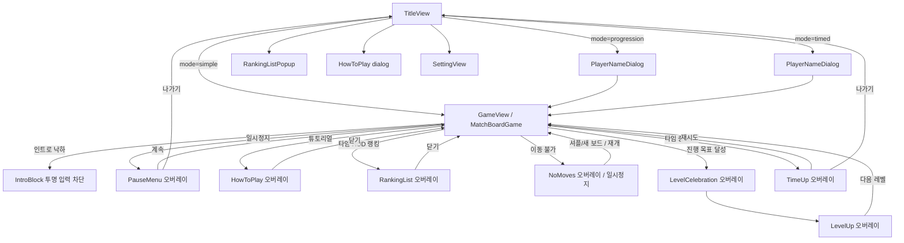

# Stone Match — 게임 플로우 (매치-3)

8×8 보드에서 인접 보석을 스왑해 3개 이상을 맞추면 제거·낙하·리필이 이어진다.

## 1. 규칙 요약

- **매치**: 가로 또는 세로로 같은 색이 3연속 이상이면 매치로 처리된다.
- **스왑**: 인접한 두 칸만 교환 가능하며, 교환 후 매치가 생기지 않으면 스왑은 되돌아간다.
- **낙하·리필**: 제거된 칸 위의 보석이 아래로 떨어지고, 빈 칸은 상단에서 새 보석이 채워진다.
- **콤보**: 한 번의 “유저 스왑”으로 연쇄 매치가 이어지면 콤보로 집계된다.
- **한 판 통계**: 유효 스왑, 매치 그룹, 제거 보석, 특수 보석 생성/발동을 `MatchBoardGameStats`에 누적한다. 게임 오버 화면의 통계 버튼으로 별도 팝업에서 확인한다.
- **심플 모드**: 시간 제한 없음.
- **진행 모드**: 60초 안에 현재 레벨 목표 점수를 넘기면 `LevelCelebration` 후 `LevelUp` 오버레이가 뜬다. 다음 레벨로 넘어가면 점수와 콤보를 초기화하고 새 보드를 생성한다.
- **타임 모드**: 60초 안에 최대 점수를 노린다. 매치 제거 단계마다 **정수 초** 보상(설계값×`timeRewardScaleForMode` 후 반올림)을 받는다. 설계상 보상이 양수(`raw > 0`)이면 반올림이 0이어도 **최소 1초**를 부여한다. 배율 0 등으로 `raw <= 0`이면 보상 없음. 상한(90초)까지 **초과분만 제외**해 가산한다. 남은 시간이 0이 되면 `TimeUp` 오버레이.
- **랭킹**: 타임 모드는 점수, 진행 모드는 도달 레벨을 서버 랭킹에 제출한다. 서버가 없어도 게임 자체는 정상 동작한다.

## 2. 특수 보석 요약

| 조건 | 생성 보석 | 효과 |
|------|----------|------|
| 4개 일렬 | `bomb` | 주변 3×3 제거 |
| T/L 모양 | `star` | 해당 행과 열 제거 |
| 5개 일렬 | `hyper` | 스왑한 상대 색 전체 제거 |
| 6개 이상 일렬 | `supernova` | 주변 3×3 + 해당 행과 열 제거 |

`row`/`col` 특수 보석은 legacy 종류로 남아 있으며, 현재 주 생성 규칙은 위 4종을 사용한다.
`bomb + bomb`, `bomb + star`, `star + star`, `hyper + hyper`는 전용 조합 효과가 있다.
생성 우선순위, 발동 조건, 조합 스왑, Bejeweled 참고 룰과의 차이는 [`special_gems_rules.md`](special_gems_rules.md)를 본다. Bejeweled식 원본과 다른 Hyper + Flame/Star 처리는 해당 문서에 Stone Match식 대체 구현으로 표시되어 있다.

## 3. 화면·오버레이 흐름

## 4. 코드 기준 흐름 (요약)

1. 타이틀에서 `/game?mode=...` 로 진입 → `GameView`가 `GameWidget<MatchBoardGame>` 생성.
2. `GameView`는 첫 프레임 뒤 `GameWidget`을 마운트하고 최소 350ms 동안 `GameLoadingOverlay`를 보여준다.
3. `MatchBoardGame.onLoad`에서 `MatchGameHud`(viewport) → `MatchBoardRenderer`(world) → 파티클/특수효과 풀 → QA bridge 순으로 붙는다.
4. 첫 유효 레이아웃(`onGameResize` → `_syncLayout`)에서 타일 크기·보드 위치가 정해지고 `generateFreshBoard`가 한 번 호출된다.
5. 입력은 `MatchGameHud`가 받고, 스왑/상태 전이/점수는 `MatchBoardLogic`, 보석 그리기는 `MatchBoardRenderer`, 특수효과는 `SpecialEffectPool`이 담당한다.
6. `MatchBoardGame.update(dt)`는 보드 업데이트 뒤 특수효과, 카메라 흔들림, 타임/진행 모드 상태, 베스트 저장을 순서대로 갱신한다.

더 자세한 파일 단위 설명은 [`code-flow-analysis.md`](code-flow-analysis.md)를 본다.
