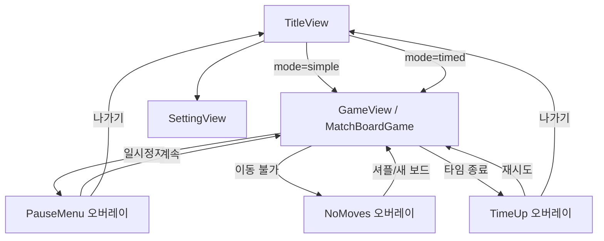

# Jewel Match — 게임 플로우 (매치-3)

8×8 보드에서 인접 보석을 스왑해 3개 이상을 맞추면 제거·낙하·리필이 이어진다.

## 1. 규칙 요약

- **매치**: 가로 또는 세로로 같은 색이 3연속 이상이면 매치로 처리된다.
- **스왑**: 인접한 두 칸만 교환 가능하며, 교환 후 매치가 생기지 않으면 스왑은 되돌아간다.
- **낙하·리필**: 제거된 칸 위의 보석이 아래로 떨어지고, 빈 칸은 상단에서 새 보석이 채워진다.
- **콤보**: 한 번의 “유저 스왑”으로 연쇄 매치가 이어지면 콤보로 집계된다.
- **심플 모드**: 시간 제한 없음.
- **타임 모드**: 매치 제거 단계마다 **정수 초** 보상(설계값×`timedModeTimeRewardScale` 후 반올림). 설계상 보상이 양수(`raw > 0`)이면 반올림이 0이어도 **최소 1초**를 부여한다. 배율 0 등으로 `raw <= 0`이면 보상 없음. 상한까지 **초과분만 제외**해 가산한다. 남은 시간이 0이 되면 `TimeUp` 오버레이.

## 2. 화면·오버레이 흐름

## 3. 코드 기준 흐름 (요약)

1. 타이틀에서 `/game?mode=...` 로 진입 → `GameView`가 `GameWidget<MatchBoardGame>` 생성.
2. `MatchBoardGame.onLoad`에서 `SpaceBg`(배경) → `MatchGameHud`(뷰포트) → `MatchBoardRenderer`(월드) 순으로 붙는다.
3. 첫 유효 레이아웃(`onGameResize` → `_syncLayout`)에서 타일 크기·보드 시드가 정해지고 `generateFreshBoard`가 한 번 호출될 수 있다.
4. 입력·상태 전이·점수는 `MatchBoardLogic`, HUD·타임바·일시정지는 `MatchGameHud`, 보석 그리기는 `MatchBoardRenderer`.

더 자세한 파일 단위 설명은 [`code-flow-analysis.md`](code-flow-analysis.md)를 본다.
